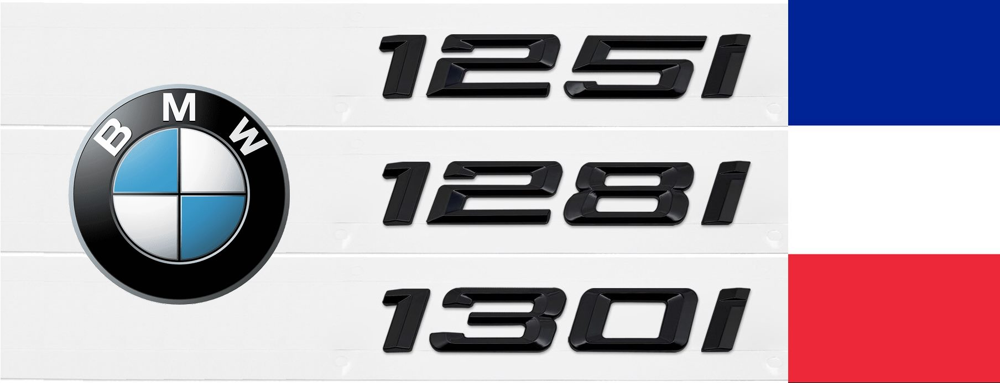
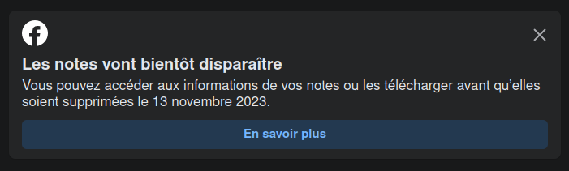
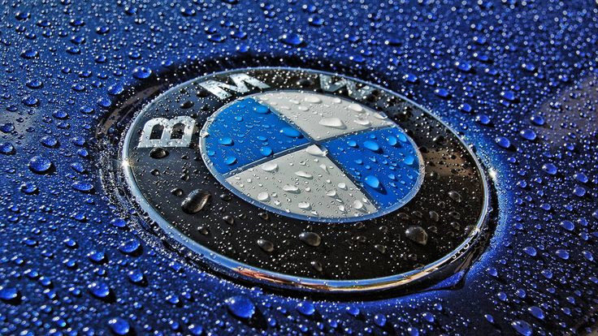

# Les BMW 125i-128i-130i à moteur N52B30

**Base de connaissances** pour les possesseurs et fans du modèle équipé du moteur N52, le dernier 6 cylindres en ligne (L6) atmosphérique à injection indirecte de la marque.

- [Les versions concernées](#les-versions-concernées)
- [Le groupe Facebook](#le-groupe-facebook)
- [Pourquoi ce site ?](#pourquoi-ce-site-)
- [Les bases / Découvrir le modèle](#les-bases--découvrir-le-modèle)
- [Sommaire général](#sommaire-général)

## Les versions concernées

Les versions sont les suivantes :

- 130i E87 : 5 portes
- 130i E81 : 3 portes (depuis 2007)
- 125i E82 / E88 : coupé / cabriolet (depuis 2008)
- 128i E82 / E88 : coupé / cabriolet (modèles US et Canada)

Ces modèles sont **exclusivement** équipés du moteur 6 cylindres en ligne essence atmosphérique à injection indirecte (code N52B30) avec différentes puissances : 218ch (125i), 230ch (128i), 258ch (130i ED à partir de fin 2008) et 265ch (130i de 2005 à 2009).

Dans les générations ultérieures il existe aussi des 125i ou 128i mais équipées d'un moteur 4 cylindres turbo.

## Le groupe Facebook

Groupe **privé** consacré aux **BMW Série 1** équipées du **moteur N52** de génération E8X et dédié aux propriétaires (actuels, anciens ou futurs) ou simplement aux passionnés de la marque et des moteurs L6i.

Accès  : <https://www.facebook.com/groups/130ifrance/>

**/!\\ RÉPONDRE AU QUESTIONNAIRE D'ADHÉSION EST OBLIGATOIRE POUR INTÉGRER LE GROUPE /!\\** (2 petites questions + accepter les règles du groupe)

**/!\\ Toute demande incomplète sera rejetée /!\\**

## Pourquoi ce site ?

Suite à l'arrêt puis la suppression des notes Facebook (également nommées documents) pour ne pas perdre toute cette base de connaissances initialement présente sur le groupe et continuer à partager les informations utiles aux possesseurs ou futur acquéreurs du modèle.

## Les bases / Découvrir le modèle

- [Informations générales](infos_gene/infos_gene.md)
- [Synthèse de l'entretien du moteur N52](entretien/synthese_entretien.md)

## Sommaire général

### Informations générales

- [Informations générales](infos_gene/infos_gene.md)
- [L'équipement de série des 130i françaises](infos_gene/equipement.md)
- [Les jantes les plus communes pour 125i et 130i](infos_gene/jantes.md)
- [Tout savoir sur son véhicule à l’aide du VIN](infos_gene/vin.md)
- [Les différents pare-chocs et différentes calandres](infos_gene/parechocs.md)
- [Les montes pneumatiques](infos_gene/pneus.md)
- [Les teintes de carrosserie](infos_gene/teintes.md)
- [Trucs et astuces](infos_gene/trucs_astuces.md)
- [Le glossaire](infos_gene/glossaire.md)

### L'entretien

- [Synthèse de l'entretien du moteur N52](entretien/synthese_entretien.md)
- [Synthèse sur l'entretien du système de refroidissement](entretien/refroidissement.md)
- [Remplacement de la pompe à eau électrique et du thermostat/calorstat](entretien/pae.md)
- [Remplacement du séparateur d'huile ou CCV](entretien/CCV.md)
- [Remplacement des joints du support de filtre à huile](entretien/support_filtre_huile.md)
- [Informations sur le démarreur](entretien/demarreur.md)
- [Remplacement des supports / silent-blocs de boite](entretien/silent_blocs_BV.md)

### Le moteur N52B30

- [Les consignes concernant les vis en aluminium](moteur/vis_alu.md)
- [Informations sur les valves DISA](moteur/disa.md)
- [Informations sur les les électrovannes (solénoïdes) du système VANOS](moteur/vanos_electrovanes.md)
- [Informations sur les valves anti-retour du système VANOS](moteur/valves_antiretour.md)
- [Ensemble de ressources vidéos concernant le moteur N52](moteur/videos.md)

### Tutos

- [Remplacement de la batterie](tutos/batterie.md)
- [Remplacement du liquide de frein avec Gunson eezibleed](tutos/ldf_eezibleed.md)
- [Vidange de la boite de vitesses manuelle](tutos/vidange_boite.md)
- [Vidange du différentiel arrière (pont)](tutos/vidange_pont.md)
- [Remplacement des supports de cric](tutos/supports_cric.md)
- [Remplacement de la tige du capteur d’assiette des Xénons (avant)](tutos/tige_capteur_assiette.md)
- [Procédure de ré-initialisation du toit ouvrant](tutos/toe.md)
- [Remplacement des vérins de coffre ou de capot](tutos/verins.md)
- [Modification de la valve à l'embrayage (CDV)](tutos/modif_CDV.md)
- [Rentrer dans les menus cachés de l'ODB](tutos/menus_caches_odb.md)

### Les fiches

- [Checklist pour la vidange moteur](fiches/checklist_vidange.md)
- [Checklist pour le passage au contrôle technique](fiches/checklits_ct.md)

### Divers

- [La 130i dans la presse](divers/presse.md)
- [Achat de pièces : tous liens "commerciaux" utiles](divers/liens_commerciaux.md)
- [Le modèle LSE : Limited Sports Edition](divers/LSE.md)
- [Spécialistes BMW : les bonnes adresses](divers/specialistes.md)

