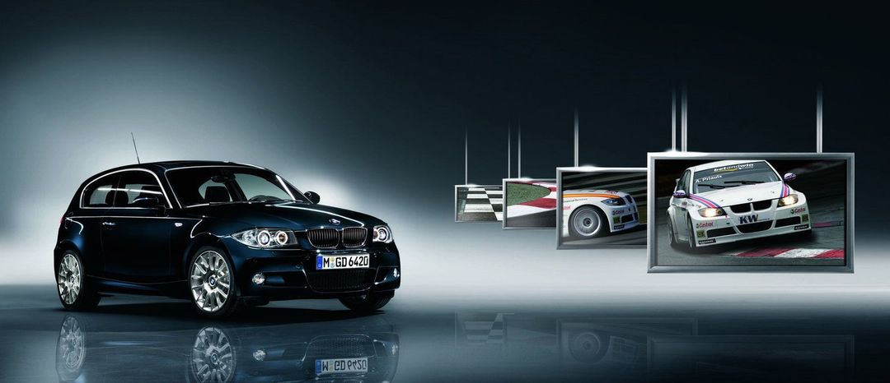
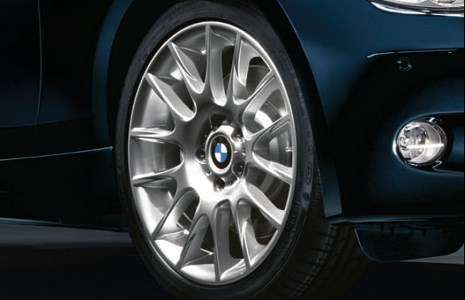

# [FAQ] Modèle LSE : Limited Sports Edition

Série limitée produite à seulement 2000 exemplaires.

## Spécificités

- E81 uniquement
- Pack M intérieur / extérieur
- Chrome Line
- Jantes 216M 18" spécifiques, style WTCC (taille de pneus standard : 215-40R18 à l'avant et 245-35R18 à l'arrière)
- Teinte unique et exclusive **Carbonschwarz**
- Contour en chrome du  bouton Start/Stop avec l’inscription "Limited Edition"

et c’est tout !

## Pays

Uniquement disponible à l’époque (2007) dans les pays européens suivants :

- Belgique
- Luxembourg
- Allemagne
- Royaume-Uni
- Italie

## Motorisations

- 118i et 118d
- 120i et 120d
- 130i

## Liens

- [BMW série 1 "Limited Sport Edition"](http://www.auto-pub.net/ASL/page_BMW_serie1_Ltd_Sport_Ed_D.htm)
- [Communiqué de presse: BMW Série 1 "Limited Sports Edition".](https://www.press.bmwgroup.com/belux/article/detail/T0028228FR/communiqu%C3%A9-de-presse:-bmw-s%C3%A9rie-1-limited-sports-edition?language=fr)
- [Caradisiac : BMW Série 1 Limited Sports Edition](https://www.caradisiac.com/BMW-Serie-1-Limited-Sports-Edition-comme-son-nom-l-indique-14701.htm)
- [AutoBlog : BMW introduces 1-Series 3-door Limited Sports Edition](https://www.autoblog.com/2007/01/25/bmw-introduces-1-series-3-door-limited-sports-edition/)

## Galeries photos

- [Flick R - Ludo68 ](https://www.flickr.com/photos/ludo68/with/48158866052/)
- [bimmerarchive : salon de Leipzig](https://www.bimmerarchive.org/photo/gallery-61-automobil-international-ami-leipzig-2007.html)

---
:point_left: [Retour au sommaire](../README.md#sommaire)
