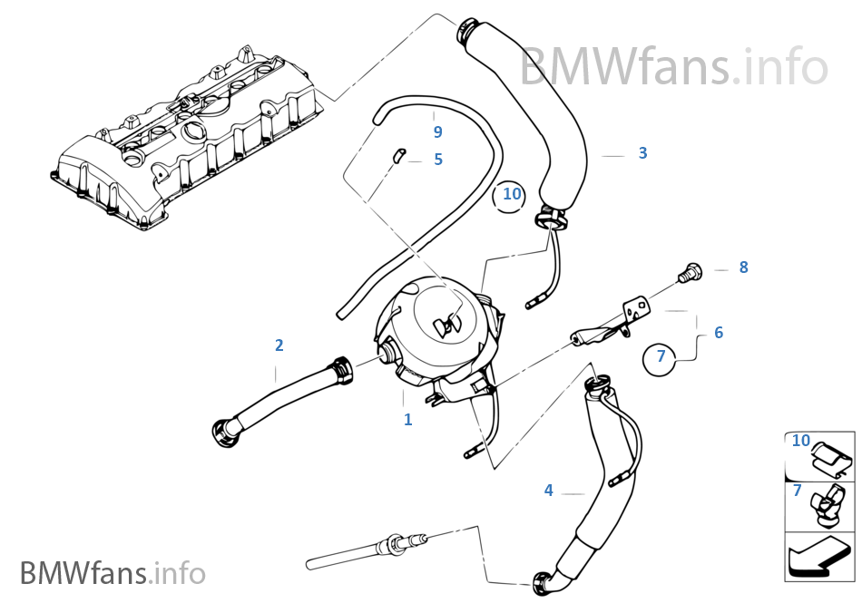
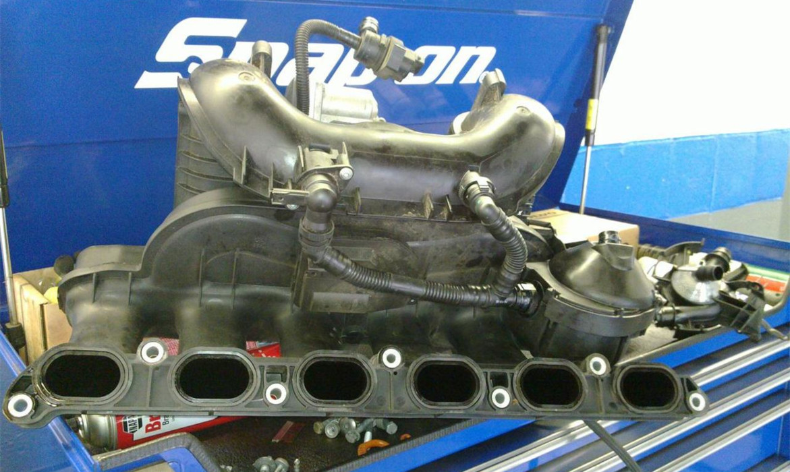

# [Fiche entretien] Remplacement du séparateur d'huile

**ATTENTION :**

- E87 Phase 1 : couvre culasse gris : Séparateur d'huile externe à changer avec sa tuyauterie
- E8X Phase 2 : couvre culasse noir en plastique : Séparateur d'huile interne : changer tout le couvre culasse.

## CCV ?

CCV = _CrankCase Ventilation Return Pipe_ ou reniflard d'huile ou séparateur d'huile est un ensemble de pièces permettant de récupérer les vapeurs d'huile,afin d'éviter de les renvoyer en grande quantité directement dans l'admission.

[schéma](http://fr.bmwfans.info/parts-catalog/E87/Europe/130i-N52/L-N/jan2006/browse/engine/crankcase_ventilation_oil_separator/)

## Préconisation

Tous les 150 000km environ

## Ca ressemble à quoi ?

Installé sur mle collecteur d'admission :

## Pièces

- Séparateur d´huile - 11 61 7 531 423
- Tuyau flexible de ventilation - `11 61 7 559 530`
- Conduite de ventilation - `11 15 7 522 931`
- Tuyau de retour - `11 15 7 567 801`
- Capuchon - `11 61 7 547 229`
- Joints de collecteur - Jeu joints de profil `11 61 7 547 242`

## Tutos

- [tuto pelicanparts](https://www.pelicanparts.com/BMW/techarticles/BMW-3-Series-E90/ENGINE-Crankcase_Breather_Valve_Replacement/ENGINE-Crankcase_Breather_Valve_Replacement.htm)
- [YouTube - tuto anglais](https://www.youtube.com/watch?v=q7jOylC9VCI)

---
:point_left: [Retour au sommaire](../README.md#sommaire)
