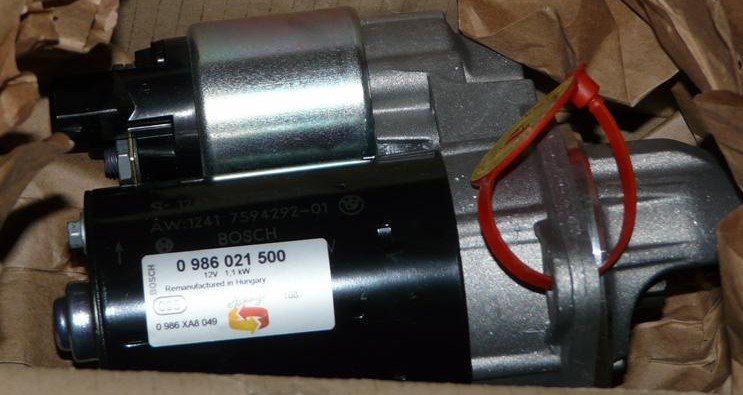

# [FAQ] Informations sur le démarreur

## Le situer

Le démarreur est placé sous le collecteur d’admission. Ce collecteur est très difficile à démonter surtout quand on ne l’a jamais fait.

On peut éventuellement y arriver sans démonter complètement le collecteur (expérience personnelle) mais c’est chiant :

## Pièces et références

- Référence BMW : `12 41 2 354 701`
- Référence Bosch : `0 986 021 500` - 150€ environ avec 50€ de consigne (= il faut renvoyer son ancienne pièce)

- Kit 3 vis alu à remplacer **obligatoirement** : `12 41 0 392 577`

Lien du schéma : <http://fr.bmwfans.info/parts-catalog/E87/Europe/130i-N52/L-N/jan2006/browse/engine_electrical_system/starter/>

Couple de serrage :

- Référence TIS : `2AZ` Fixation du démarreur sur bloc-cylindres
- Type de vis : `M10x30`
- Couple d'insertion : **20 Nm**
- Angle de rotation : **90°**

## Vidéos

- [Fab B. YouTube](https://www.youtube.com/watch?v=ESpflMlHVWs&fbclid=IwAR26XSruM2X1K-gD30BT-UvsDXxVIfuifsYlfKfu0pbkoaDKR0NavFuYsm0)
