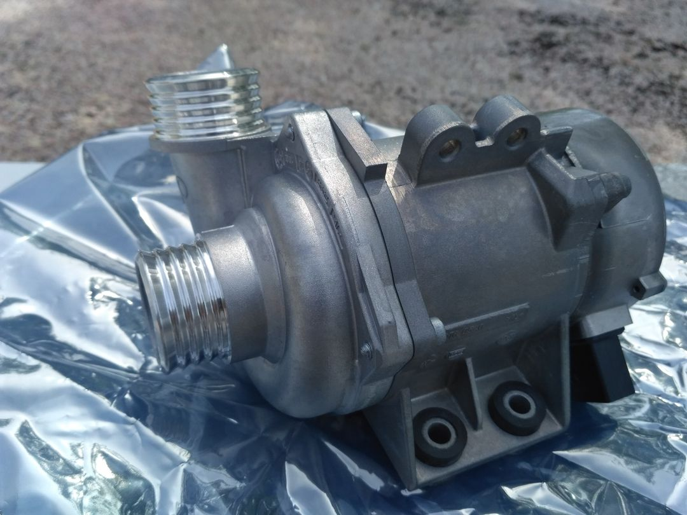
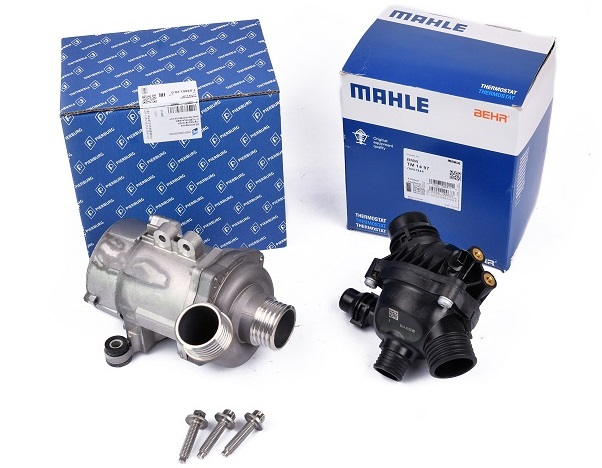
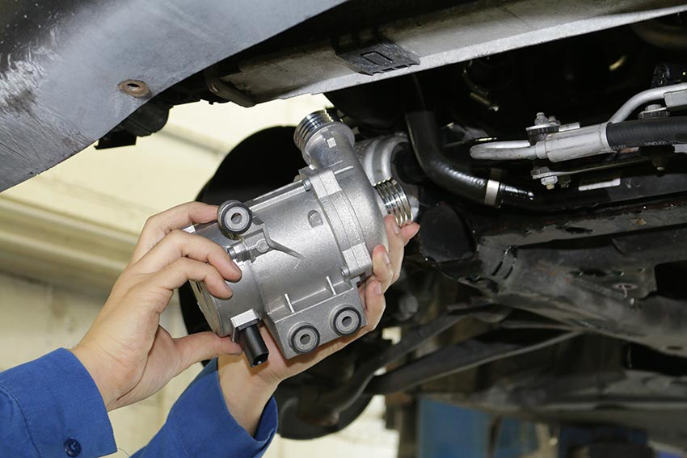
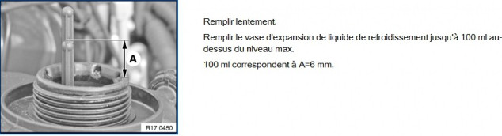

# [Fiche entretien] Remplacement de la pompe à eau électrique

## Les pièces nécessaires

Tarifs indicatifs BMW hors taxes (HT) en date du 8 juin 2018 (tarif 1) / 2017 (tarif 2)

- Pompe à eau (ref `11517586925`) : 590€ HT / 483€ HT (marque d'origine PIERBURG)
- Jeu de vis alu (ref `11510392553`) : 6.17€ HT / 5.91€ HT
- Thermostat (ref `11537549476`) : 113.29€ HT / 114.37€ HT
- Antigel (ref `83512355290`) : 15€ HT / 8.75€ HT le bidon de 1.5L (il en faut 3)
- 5L d’eau distillée pour faire le mélange 50-50 avec l’antigel

Optionnel :

- Flexible thermostat-pompe liquide (ref `11537521049`)
- Vis six pans avec rondelle liaison thermostat-pompe (ref `07119905400`)
- Bouchon de radiateur (ref `17107523260`): 8.75€ HT

Contenance du LDR :

- 8.5L avec climatisation automatique
- 8.2L avec climatisation manuelle

Pour se faire une idée des tarifs BMW consulter <https://www.leebmann24.de/> et taper la référence de la pièce dans la zone de recherche.

## Procédure avant d’effectuer la purge automatique

- Ouvrir la vis de purge (a coté du bouchon de remplissage du bocal)
- Monter le niveau de LDR jusqu'au niveau inférieur du bouchon (jusqu'à être au niveau de la partie supérieure plate du bocal... on ne monte pas  jusqu'au haut du filetage du - bouchon de remplissage)
- Laisser couler le LDR par la vis de purge jusqu'à ce que ça coule sans  bulle (maintenir le niveau de LDR au seuil indiqué à l'étape précédente)
- Refermer la vis de purge (3,5Nm)
- Refermer le bouchon de remplissage du bocal.

## Procédure de vide d’air du circuit

- Insérer la clé et mettre le contact.
- Régler le chauffage à la température maximale et la ventilation au minimum.
- Enfoncez la pédale d’accélérateur en butée pendant 10s, ce qui déclenchera la procédure de purge.
- La pompe électrique va s’enclencher et fonctionner pendant une dizaine de minutes (**10 à 12 minutes**).

## Liens utiles

- **Schéma via bmwfans :** [Système de refroidissement - pompe eau/thermostat](http://fr.bmwfans.info/parts-catalog/E87/Europe/130i-N52/L-N/jan2006/browse/engine/waterpump_thermostat/)
- **Schéma via bmwfans :** [Système de refroidissement - durites](http://fr.bmwfans.info/parts-catalog/E87/Europe/130i-N52/L-N/jan2006/browse/engine/cooling_system_water_hoses/)
- <https://www.pelicanparts.com/BMW/techarticles/BMW-3-Series-E90/WATER-Thermostat_Replacement/WATER-Thermostat_Replacement.htm>
- <https://www.pelicanparts.com/BMW/techarticles/BMW-3-Series-E90/WATER-Coolant_Pump_Replacement/WATER-Coolant_Pump_Replacement.htm>
