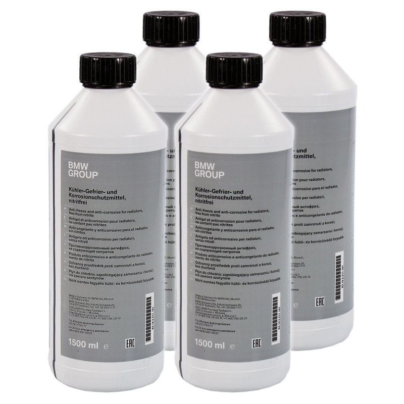
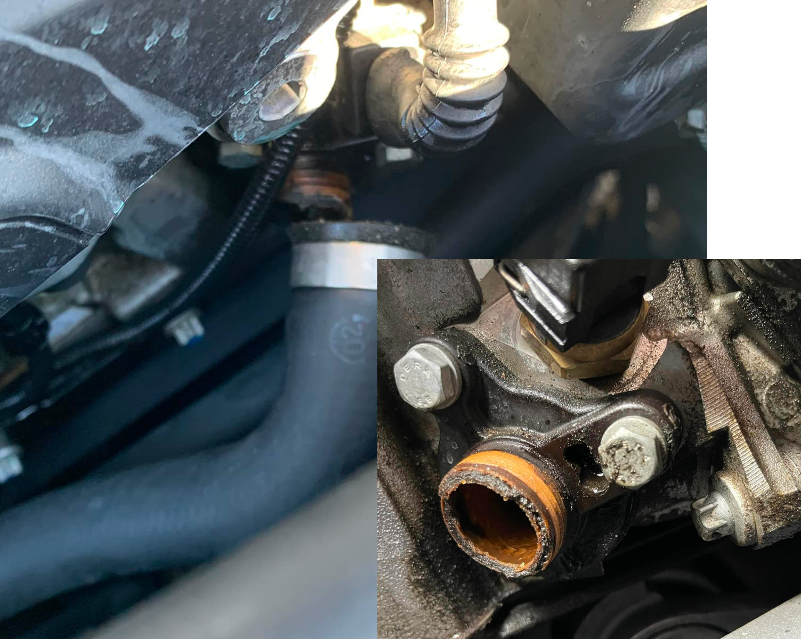
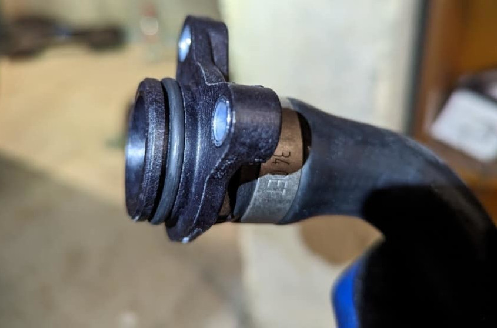
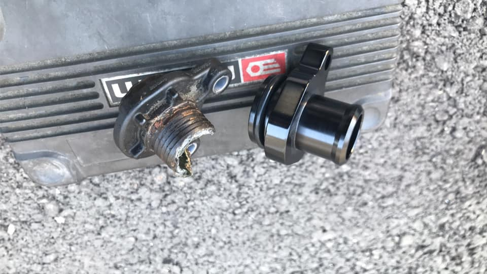
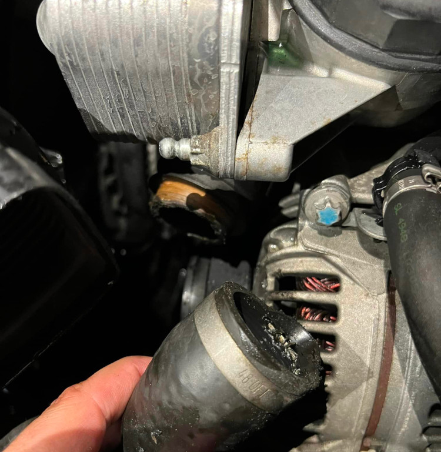
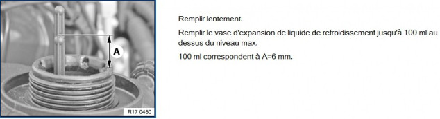
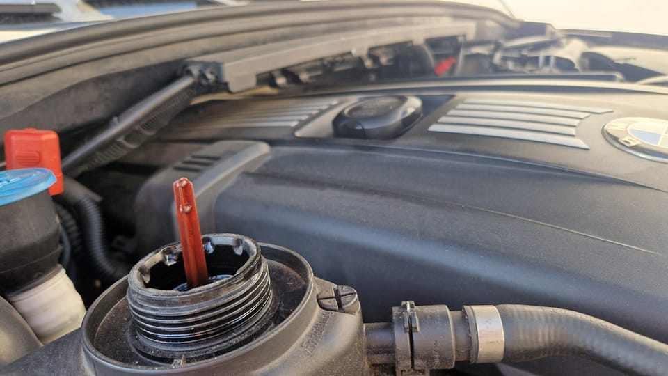

# [Fiche entretien] Système de refroidissement

## Liquide refroidissement

- antigel BMW– 8€ 1,5L Ref `83512355290`
- norme GS 94000
- mélange 50-50 : eau et antigel

## Raccord de refroidissement (1)

Raccord dit "tête de Mickey", **pièce à changer car avec l'age elle se détériore.**

[Schéma RealOEM](https://www.realoem.com/bmw/fr/showparts?id=UF91-EUR---E87-BMW-130i&diagId=11_3755) - [Schéma 2](https://www.realoem.com/bmw/fr/showparts?id=UF91-EUR---E87-BMW-130i&diagId=11_3755)

- 07 Flexible culasse-thermostat 1 `11537545890`
- 08 Joint torique 29X2,9 1 `11537545278`
- 10 Vis six pans avec rondelle M6X23  2 `07119905591`

La pièce BMW inclue tout le tuyau :

[Pièce en alu sur Amazon](https://www.amazon.fr/gp/product/B07K7KHLVR/ref=ppx_yo_dt_b_asin_title_o09_s00?ie=UTF8&psc=1)

:warning: **Utiliser un joint torique d'origine BMW et pas celui fourni !**

## Raccord de refroidissement (2)

Flexible relié à l'échangeur air/huile, **pièce à changer car avec l'age elle se détériore.**

[Schéma RealOEM](https://www.realoem.com/bmw/fr/showparts?id=UF91-EUR---E87-BMW-130i&diagId=17_0699#17127531579) - Pièce 17

- 17 Flexible départ moteur- haut radiateur - Ref `17127531579`

[Oscaro](https://www.oscaro.com/fr/search?q=17127531579)

## Niveau

Suivre la consigne suivante :

## Purge d'air du circuit

Voir fiche sur la pompe à eau.

## Vidéos

- [YouTube - BREIZHTRACKRIDER](https://www.youtube.com/watch?v=ARHfLJsCC9w&t=89s&ab_channel=BREIZHTRACKRIDER)

---
:point_left: [Retour au sommaire](../README.md#sommaire)
