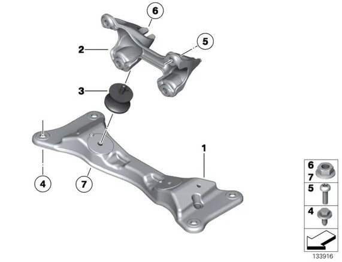

# [Fiche entretien] Remplacement des supports / silent-blocs de boite

## Schéma

## Pièces, références et tarifs indicatifs

Les supports d'origine peuvent être remplacés par des supports de M3 E46, à priori plus rigides.

- Ref OEM : `22 31 6 799 331`
- Ref M3 E46 : `22 32 2 282 340` - [RealOEM](https://www.realoem.com/bmw/enUS/showparts?id=BL93-USA-05-2006-E46-BMW-M3&diagId=22_0065)
- Nombre : 2

## Procédure

1. Démonter les écrous (4)x4 et (6 et 7)x2
2. Remonter les nouveaux silent-blocs en respectant les « encoches »

## Vidéos

[Tuto Youtube BREIZH TRACKRIDER](https://youtu.be/8NOWrd4oudM)
