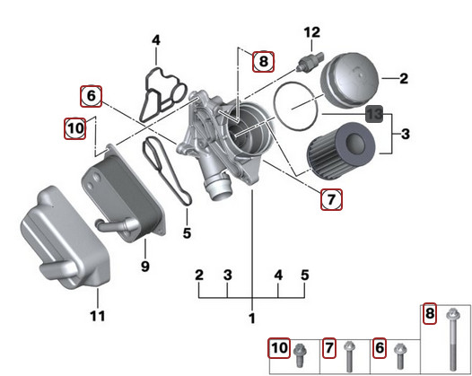

# [Fiche entretien] Remplacement des joints du support de filtre à huile

## Schéma

- [RealOEM](https://www.realoem.com/bmw/fr/showparts?id=UF91-EUR-01-2006-E87-BMW-130i&diagId=11_3753)
- [BmwFans](http://fr.bmwfans.info/parts-catalog/E87/Europe/130i-N52/L-N/jan2006/browse/engine/lubricat_syst_oil_filter_heat_exchanger/)

## Pièces, références et tarifs indicatifs

- (4) Joint côté culasse `11428637821`  (27€)
- (5) Joint côté échangeur `11428637820`   (27€)
- 3 vis de l’échangeur (douille e20, couple 16Nm)
  - (10) 3x Vis autotaraudeuse M8X20 `11427543327`  (3 x 8€)
- 3 vis du porte filtre à huile (douille e10, couple 22Nm) :
  - (6) Vis ASA M8X28 `11427540759`  (2€)
  - (7) Vis ASA M8X43 `11427540763`  (3€)
  - (8) Vis ASA M8X78 `11427540758`  (3€)

## Étapes du démontage

- démonter le filtre à air
- démonter la boite à air
- débrancher le débimètre et démonter le collier de serrage de la durite d'air

## Rappel de la procédure de vide d’air du circuit d’eau

1. Insérer la clé et mettre le contact.
2. Régler le chauffage à la température maximale et la ventilation au minimum.
3. Enfoncez la pédale d’accélérateur en butée pendant 10s, ce qui déclenchera la procédure de purge.
4. La pompe électrique va s’enclencher et fonctionner pendant une dizaine de minutes.

## Vidéos

- [YouTube - Tuto anglais](https://www.youtube.com/watch?v=KBs7xdz547Q)

---
:point_left: [Retour au sommaire](../README.md#sommaire)
