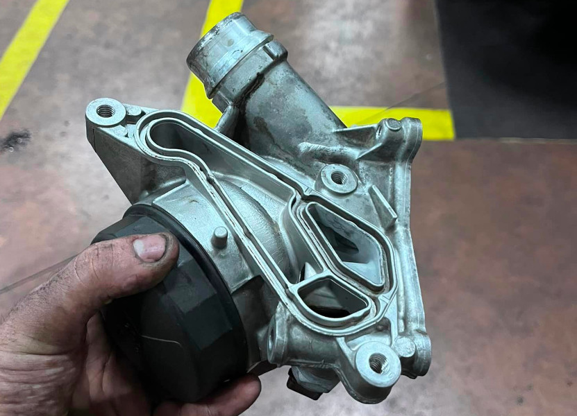
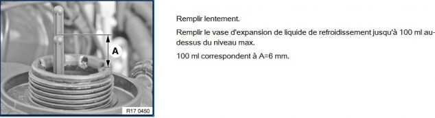

# [Fiche entretien] Remplacement des joints du support de filtre à huile

## Schéma

- [RealOEM](https://www.realoem.com/bmw/fr/showparts?id=UF91-EUR-01-2006-E87-BMW-130i&diagId=11_3753)
- [BmwFans](http://fr.bmwfans.info/parts-catalog/E87/Europe/130i-N52/L-N/jan2006/browse/engine/lubricat_syst_oil_filter_heat_exchanger/)

## Pièces, références et tarifs indicatifs

- (4) Joint côté culasse `11428637821`  (27€)
- (5) Joint côté échangeur `11428637820`   (27€)
- 3 vis de l’échangeur (douille e20, couple 16Nm)
  - (10) 3x Vis autotaraudeuse M8X20 `11427543327`  (3 x 8€)
- 3 vis du porte filtre à huile (douille e10, couple 22Nm) :
  - (6) Vis ASA M8X28 `11427540759`  (2€)
  - (7) Vis ASA M8X43 `11427540763`  (3€)
  - (8) Vis ASA M8X78 `11427540758`  (3€)

## Étapes du démontage

- démonter le filtre à air
- démonter la boite à air
- débrancher le débimètre et démonter le collier de serrage de la durite d'air

## Rappel de la procédure de vide d’air du circuit d’eau

1. Insérer la clé et mettre le contact.
2. Régler le chauffage à la température maximale et la ventilation au minimum.
3. Enfoncez la pédale d’accélérateur en butée pendant 10s, ce qui déclenchera la procédure de purge.
4. La pompe électrique va s’enclencher et fonctionner pendant une dizaine de minutes.

## Informations des membres du groupe

Richard R. :

> Pour un meilleur accès il faut enlever la boîte à air (2 vis de 10 à droite de la boîte à air, du torx de 20 ou 25 pour enlever l'arrivé d'air, débrancher le debimètre et enlever le collier de serrage de la durite d'air, rien de vraiment compliqué en fait.
> Il faut enlever du liquide de refroidissement (perso j'ai tout enlevé)
Pour les vis en e10 (couple au remontage de 22nm) il faut avoir une douille e10 en 1/4 sinon ça passe pas pour la vis 'cachée' derrière l'admission d'air (il faut aussi une rallonge 1/4 et un cardan 1/4)
> Et pour mieux atteindre la vis à gauche (toujours e10) de l'échangeur huile/liquide de refroidissement il vaut mieux enlever la durite d'eau juste à côté.
> Attention en enlevant cette durite il y a un joint torique (11537545278 .... 4€50!) moi il s'est cassé au remontage (fuite de liquide de refroidissement), j'ai remplacé avec un joint que j'avais dans un assortiment de joint (29mm en diamètre intérieur),
>
> Pour les vis e12 aucune difficulté (couple au remontage 16nm)
> Bien protéger avec des chiffons ce qu'il va couler (un peu d'huile et un peu de liquide de refroidissement),
>
> On enlève les joints on nettoie bien les portés et on remonte avec les couples de serrage.
> Puis on remplit de liquide de refroidissement.
> Et on contrôle qu'il n'y ait pas de fuite.

Quentin Cbg :

>Pour ceux qui se poseraient la question de savoir s’il faut les changer :
>
>- l'un fait une fuite sur la courroie accessoire/alternateur et dans le petit creux sous le couvercle du filtre à huile (c'est très rarement le joint torique du filtre à huile et bien plus souvent le joint N.5)
>- l'autre sur le bloc sous le collecteur d'admission.

## Vidéos

- [YouTube - Tuto anglais](https://www.youtube.com/watch?v=KBs7xdz547Q)

---
:point_left: [Retour au sommaire](../README.md#sommaire)
