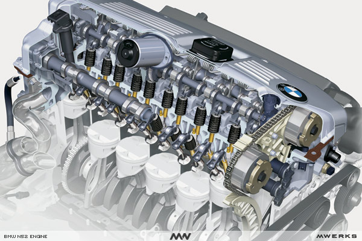
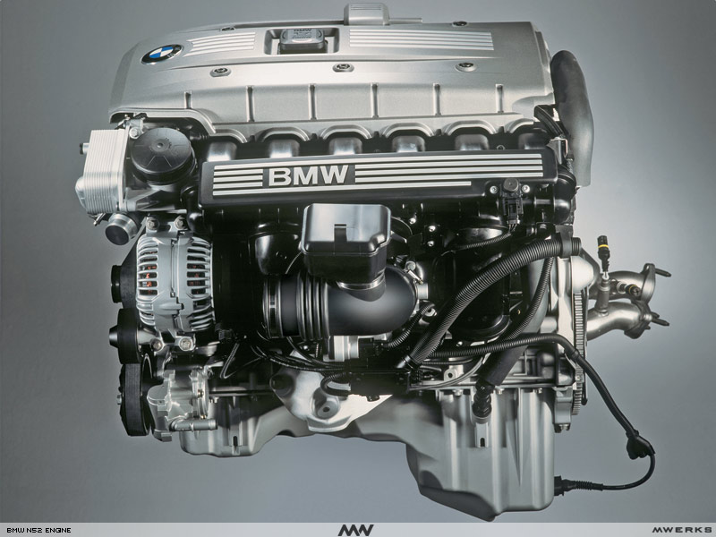
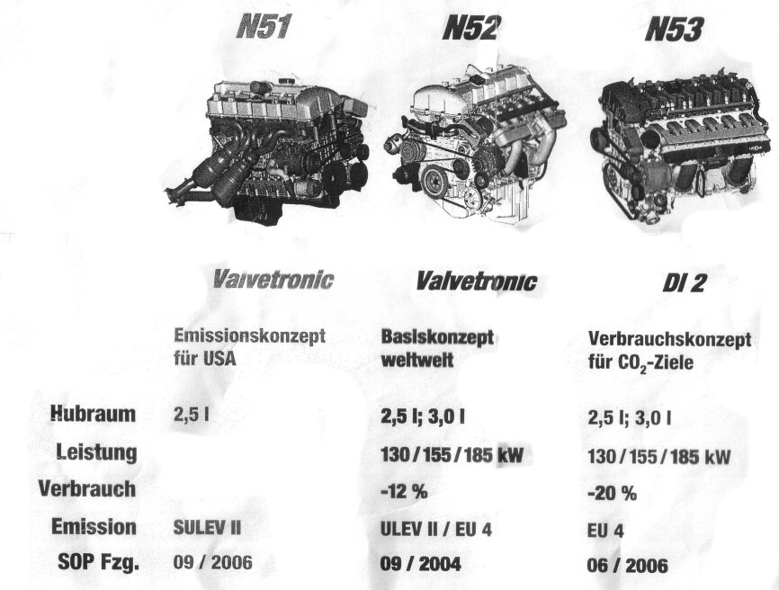
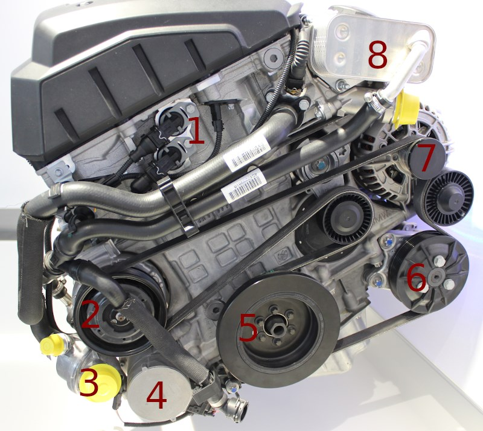
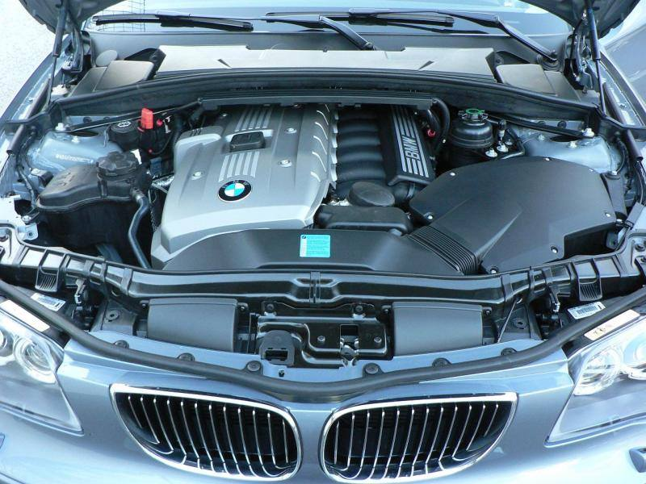
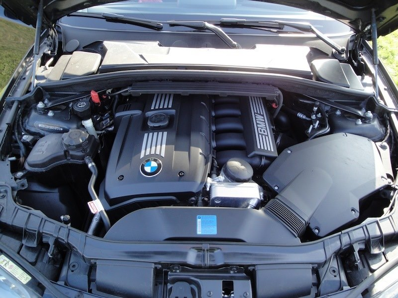
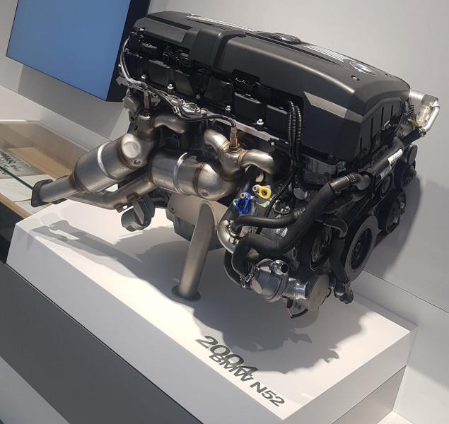
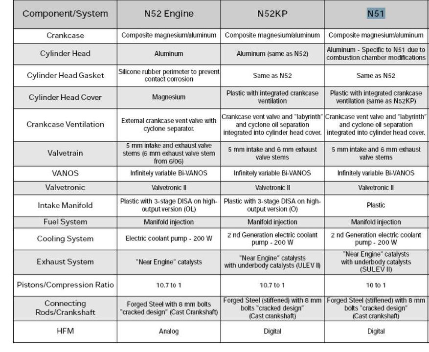

# [FAQ] Informations générales

## 1- Le moteur N52

### Code N52B30

- N = New Engine Generation
- 52 = 6 cylindres
- B = essence
- 30 = cylindrée = 3.0L

6 cylindres atmosphérique essence, 3 litres, injection **indirecte**, le dernier de la marque, le N53 étant le dernier mais à injection directe.

On peut retrouver également ce moteur dans d’autres modèles de la marque :

- Série 3 E90-E91-E92 (certaines 325i, 330i)
- Série 128i (USA / Canada)
- Z4 E85 (3.0si)
- Série 5 E60-E61 (528i, 530i)
- Série 6 E63-E64 (630i)
- Série 7 E65 (730i)
- X1 E84 (25i, 28i)
- X3 E83 (25si, 3.0si)
- X5 E70 (3.0si)

Comparatif avec les autres moteurs :

### Éléments marquants

- Dernier L6 atmosphérique BMW (avec le N53 à injection directe et sans Valvetronic)
- Pompe à eau électrique
- **Pas de jauge d’huile manuelle**, seulement électronique au tableau de bord
- Valvetronic 2 (double VANOS)
- Bloc en alliage de magnésium et d’aluminium

### Avant du moteur

1. Solénoïdes de Vanos
1. Compresseur de climatisation
1. Thermostat
1. Pompe à eau électrique
1. Poulie damper : poulie de vilebrequin
1. Pompe de direction assistée (pour direction hydraulique ou AFS)
1. Alternateur
1. Échangeur huile / eau

## 2- Les différents modèles de Série 1

> Tous les modèles suivants sont équipés du moteur N52B30 (donc tous en cylindrée de 3.0L).

### 130i E87 Phase 1 (type mine UF91)

- 265ch - 18 Cv
- Septembre 2005 à Mars 2007
- Direction hydraulique

### 130i E87 Phase 2 (type mine UD91)

- 265ch puis 258ch - 17 Cv
- Direction électrique (sauf AFS - direction active)

### 130i E81 Phase 2 (type mine UB11)

- 265ch puis 258ch - 17 Cv
- Direction électrique (sauf AFS - direction active)

### 125i E82 (type mine UC31)

- 218ch - 13Cv
- Direction électrique (sauf AFS - direction active)

### 125i E88 (type mine UL11)

- 218ch - 13Cv
- Direction électrique (sauf AFS - direction active)

### 128i E82 (Canada & USA)

- 230ch
- Direction électrique (sauf AFS - direction active)

## 3- Évolutions du moteur N52

### Les versions

**Moteur N52 (Phase 1 - 2005 - 2007)**

**Signes distinctifs :** cache gris, présence du bocal de liquide de direction assistée

- Puissance : 265ch à 6600 tours
- Puissance fiscale : 18CV
- Couple : 315Nm à 2750 tours
- Rejets CO2 : 221g / km

**Moteur N52N (ou N52K ou N52KP) (Phase 2.1 - 2007 - 2009)**

**Signes distinctifs :** cache noir, pas de bocal de liquide de direction assistée (sauf si options AFS)

- Puissance : 265ch à 6600 tours
- Puissance fiscale : 17CV
- Couple : 315Nm
- Rejets CO2 : 197g / km

**Moteur N52N (ou N52K ou N52KP)  (Phase 2.2 - 2009 - 2011)**

- Puissance : 258ch à 6600 tours
- Puissance fiscale : 17CV
- Couple maxi : 310Nm à 2 600–3 000 tours
- Rejets CO2 : 199g / km

= Le même mais en mode "_Efficient Dynamics_"

### Évolutions du N52

 (cliquer pour voir en grand)

- Nouvelle gestion du moteur (Siemens MSV80 au lieu de MSV70)
- Nouvelle HFM (numérique)
- Nouvelle accélération - EGAS8 avec retour de position magnétorésistif
- Couvercle de soupape en plastique avec vanne de ventilation intégrée du carter moteur et séparation d'huile (CCV = déshuileur = séparateur d’huile = reniflard d’huile)
- Des bielles plus fortes
- Tige de soupape d'échappement augmentée à 6 mm
- Nouvelle pompe à eau électrique (2ème génération)
- Arbres à cames légers (hydroformés)
(i) Nouvelle référence du silencieux arrière `18307551606` -> `18307568554` (constaté sur RealOEM)

Source : <https://www.forumbmw.net/topic-153-les-moteurs-bmw-n52kp-n51-n54-n55-n63-n74-introduction.html>

---
:point_left: [Retour au sommaire](../README.md#sommaire)
