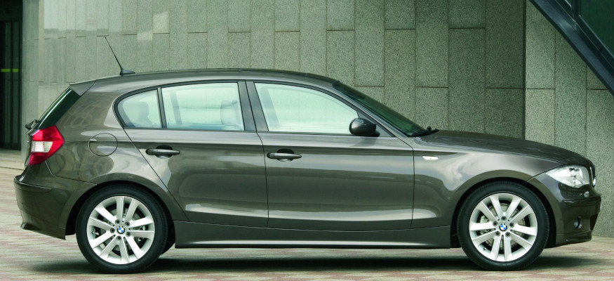

# [FAQ] Les jantes les plus communes pour 125i et 130i

Encore une question qui revient régulièrement de la part des nouveaux arrivants chez BMW.

Voici un petit aperçu de ce qui existe au catalogue BMW (standard, option, performance ou au catalogue d'accessoires) pour notre véhicule (E87 ou E81). D’autres jantes non BMW (VMR, APEX, ...) ou d’autres modèles de la gamme (F2X ou E9X par exemple) sont bien sur également possibles.

## Les tailles conseillées pour le modèle

- 17"
- 18"

En dessous de 17" les étriers de disques ne passeront pas à l'avant. Au dessus de 18" ca pourrait toucher les ailes / passages de roues.

:bulb: Pour chacune vous trouverez un lien vers <http://www.bmwstylewheels.com/>

## Le déport (ou ET)

Respecter le déport (ainsi que la largeur des jantes) est relativement important. Voici les déports des jantes d’origine (résumé) :

- 17" : Avant ET 47, Arrière ET 47 (standard) ou ET 49 (pack M)
- 18" Phase 1 : Avant ET 49, Arrière ET 49
- 18" Phase 2 : Avant ET 49, Arrière ET 52

## Les montes pneumatiques

:bulb: [Voir la fiche dédiée](pneus.md)

## Les jantes 17 pouces

### Style 207M

- Jantes de série sur pack M / Sport Design
- [Détail sur BmwStyleWheels](http://www.bmwstylewheels.com/bmw/207)

### Style 141

- Jantes de série E87 phase 1, en option E87 phase 2 / E81
- [Détail sur BmwStyleWheels](http://www.bmwstylewheels.com/bmw/141)

### Style 142

- Jantes en option
- [Détail sur BmwStyleWheels](http://www.bmwstylewheels.com/bmw/142)

### Style 256

- Jantes de série E87 phase 2 / E81
- [Détail sur BmwStyleWheels](http://www.bmwstylewheels.com/bmw/256)

## Les jantes 18 pouces

### Style 208M

- Jantes optionnelles sur pack M / Sport Design
- [Détail sur BmwStyleWheels](http://www.bmwstylewheels.com/bmw/208)

### Style 216M

- Jantes BBS exclusives de la série limitée LSE
- Jantes sans logo "///M" mais badgées "BMW Motorsport"
- [Détail sur BmwStyleWheels](http://www.bmwstylewheels.com/bmw/216)

### Style 261M

- Jantes optionnelles sur finition Sport Design
- [Détail sur BmwStyleWheels](http://www.bmwstylewheels.com/bmw/261)

### Style 261M "Ferric Grey"

- Jantes optionnelles sur finition Sport Design
- [Détail sur BmwStyleWheels](http://www.bmwstylewheels.com/bmw/261)

### Style 264

- Jantes E82 / E88
- De série sur 135i
- [Détail sur BmwStyleWheels](http://www.bmwstylewheels.com/bmw/264)

### Style 181

- Jantes au catalogue accessoires
- [Détail sur BmwStyleWheels](http://www.bmwstylewheels.com/bmw/181)

### Style 217 (en option)

- Jantes en option sur E87/E81
- [Détail sur BmwStyleWheels](http://www.bmwstylewheels.com/bmw/217)

### Style 269 Performance

- Jantes au catalogue accessoires "Performance"
- [Détail sur BmwStyleWheels](http://www.bmwstylewheels.com/bmw/269)

### Style 313 Performance

- Jantes au catalogue accessoires "Performance"
- [Détail sur BmwStyleWheels](http://www.bmwstylewheels.com/bmw/313)

---
:point_left: [Retour au sommaire](../README.md#sommaire)
