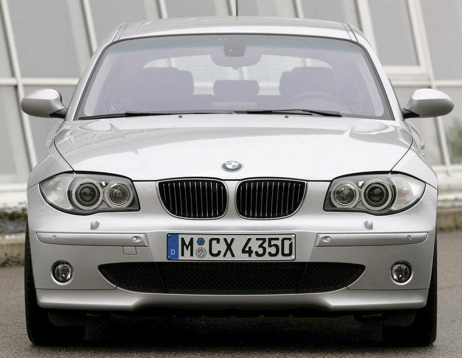
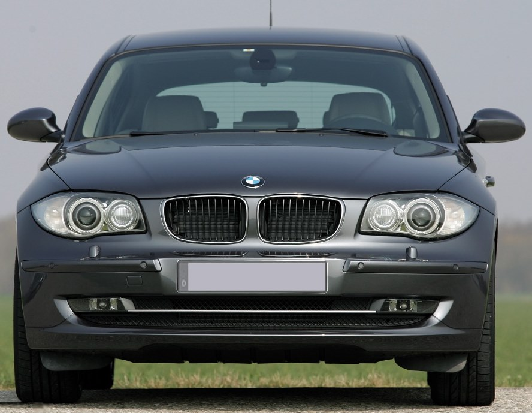
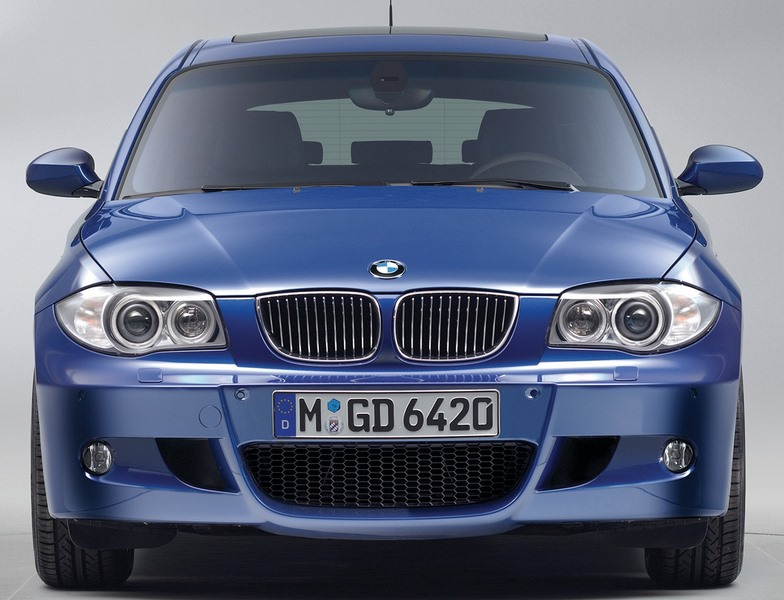
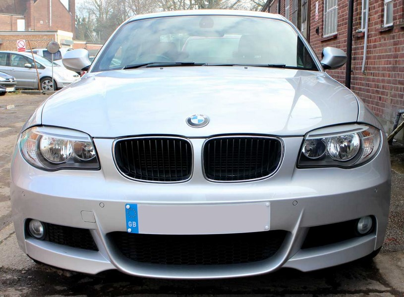
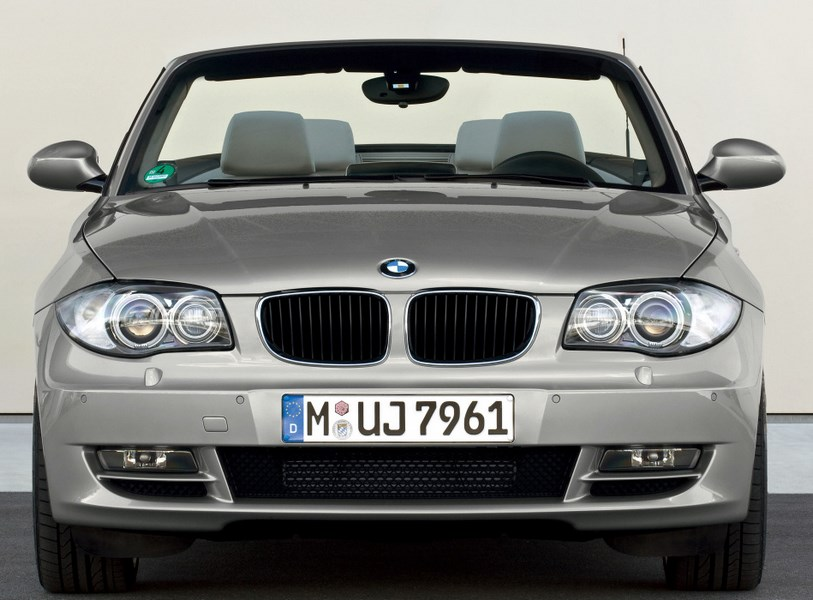
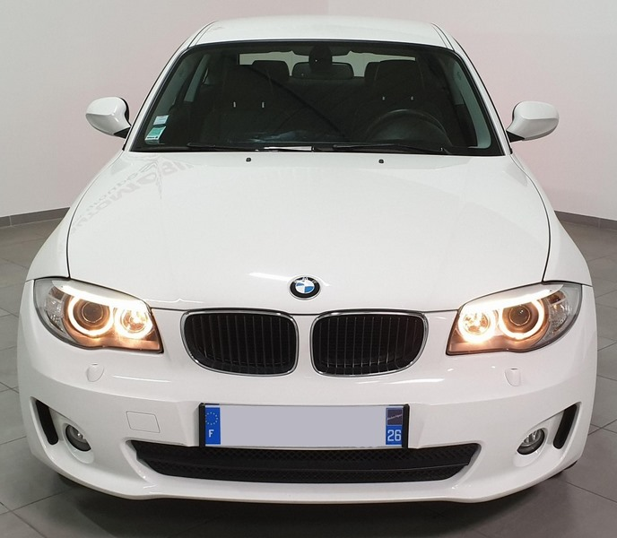
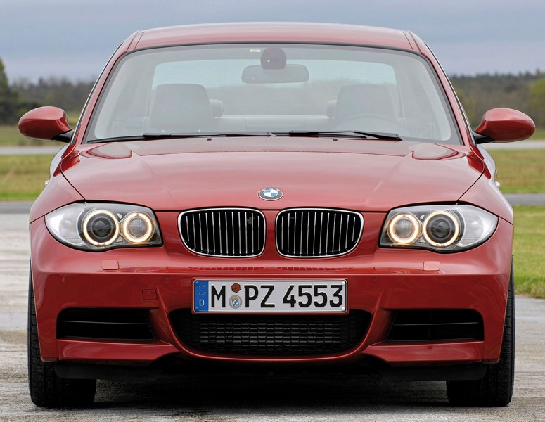
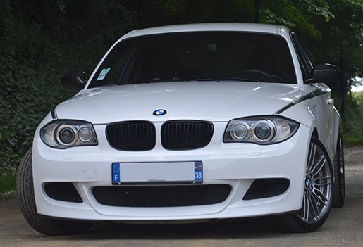
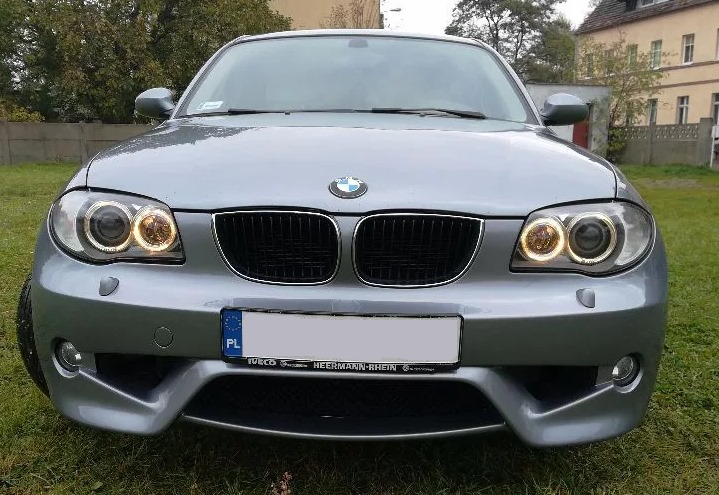

# [FAQ] E8X : Les différents pare-chocs et différentes calandres (haricot)

## E87 Phase 1(sans Pack M)

- Grille de calandre avec bouts de haricots pointus
- Si xénon, buses de lave-phares fixes

## E87 Phase 2 / E81

- Grille de calandre avec bouts de haricots arrondis
- Si xénon, buses de lave-phares fixes

## E87 Pack M / E81 Pack M

- Grille de calandre avec bouts de haricots pointus
- Si xénon, buses de lave-phares rétractables

## E82 Pack M / E88 Pack M

- Grille de calandre avec bouts de haricots arrondis
- Si xénon, buses de lave-phares rétractables

## E82 Version 1 / E88 Version 1

- Grille de calandre avec bouts de haricots arrondis
- Si xénon, buses de lave-phares fixes

## E82 Version 2 / E88 Version 2

- Grille de calandre avec bouts de haricots arrondis
- Si xénon, buses de lave-phares fixes

## E82 135i / E88 135i

- Grille de calandre avec bouts de haricots arrondis
- PC spécifique sans AB et buses de lave-phares rétractables

## E82 1M

- Grille de calandre avec bouts de haricots arrondis
- **PC NON ADAPTABLE** à cause des ailes élargies avec buses de lave-phares fixes

## Accessoire : Performance

- Grille de calandre avec bouts de haricots arrondis
- PC spécifique sans AB
- Si xénon, buses de lave-phares rétractables

## Accessoire : Kit Aero

- Grille de calandre avec bouts de haricots pointus
- Si xénon, buses de lave-phares fixes

---
:point_left: [Retour au sommaire](../README.md#sommaire)
