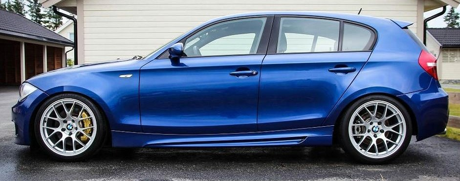
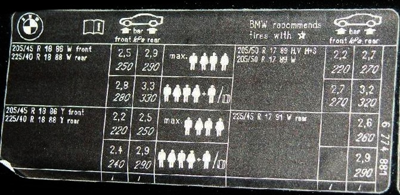
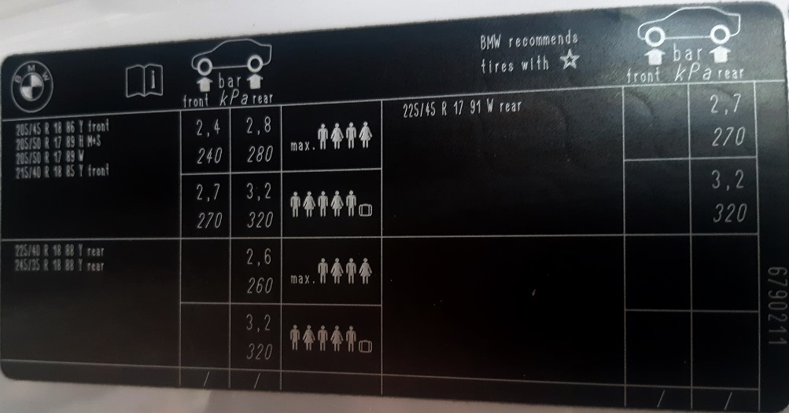
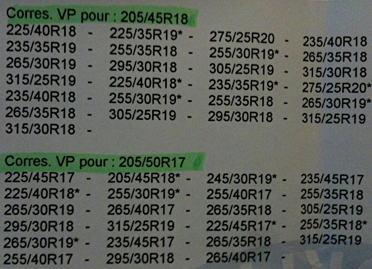
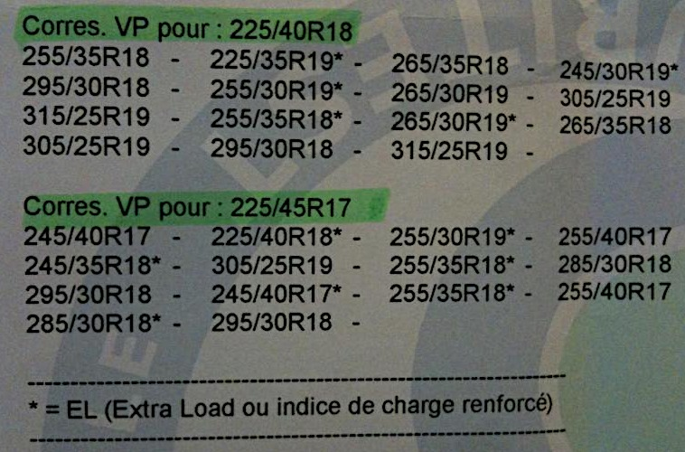

# [FAQ] Les montes pneumatiques d'origine

Encore une question qui revient souvent ...et qui n’est pas si simple qu’il n’y parait.

Il existe des différences entre E87 Phase 1 et le reste des Phase 2 et la présences des montes “mixtes” ou non. Rentre en compte également les pneus hiver ou les pneus dit à roulage à plat...

## Les montes officielles

### E87 Phase 1

**Jantes 17"** : 205/50 R 17 89W

ou en monte pneumatique mixte (généralement avec le Pack M et les jantes 207M) :

- Avant 7 J x 17" avec pneumatiques 205/50 R17
- Arrière 7,5 J x 17 avec pneumatiques 225/45 R17

**Jantes 18"** : monte pneumatique mixte :

- Avant 7,5 J x 18" avec pneumatiques 205/45 R18
- Arrière 8 J x 18" avec pneumatiques 225/40 R18

### E87 Phase 2 / E81 / E82 / E88

**Jantes 17"** : 205/50 R 17 89W

ou en monte pneumatique mixte (généralement avec le Pack M et les jantes 207M) :

- Avant 7 J x 17" avec pneumatiques 205/50 R17
- Arrière 7,5 J x 17 avec pneumatiques 225/45 R17

**Jantes 18"** : monte pneumatique mixte :

- Avant 7,5 J x 18" avec pneumatiques 215/40 R18
- Arrière 8,5 J x 18" avec pneumatiques 245/35 R18 (/!\ jante + large et pneu + large par rapport à E87 Phase 1)

### La référence

Dans TOUS LES CAS la référence reste l’étiquette qui est collée dans le montant de votre portière conducteur.

Phase 1

LCI

## Les montes officielles homologuées

Elles sont consultables via le site RealOEM.

- E87 Phase 1 : <https://www.realoem.com/bmw/fr/partgrp?id=UF91-EUR-01-2006-E87-BMW-130i&mg=85>
- E87 LCI : <https://www.realoem.com/bmw/fr/partgrp?id=UD51-EUR-01-2010-E87N-BMW-130i&mg=85>

Voici des tableaux indicatifs (issus de contrôles techniques) :

**(i)** Ce qui fait “en théorie” qu’une monte 225/40 R18 (AV) + 245/35 R18 (AR) est à priori tolérée sur E87 Phase 1. L’intérêt principal du 225/40 étant que cette monte est moins chère que la 215/40 des phase 2 !

**(!) ATTENTION** : toutefois un centre de CT un peu pointilleux ou un assureur peu scrupuleux pourraient chercher la petite bête en cas d’utilisation d’une monte non homologuée officiellement par le constructeur.

## Problématique des pneus neiges

L’utilisation de pneus neiges (ou hiver) est conseillé quand les températures descendent en dessous de 7-8°C.

Les pneus “toute saison” (marque M+S) sont également une alternative...que l’on pourra débattre pour un véhicule à usage “sportif” qu’est la 125i/130i.

**(i)** La monte **205/50 R17** (89H) "aux 4 coins" semble être la plus répandue pour ce type de pneus.

(incomplet - à détailler)

## Problématique des pneus à roulage à plat (RUNFLAT)

(à détailler)

## Pour aller plus loin

Le site **TNPF** (Travaux de Normalisation des Pneumatiques pour la France) : <https://www.tnpf.fr/vehicules_legers/home/> et son tableaux d’équivalence dimensionnelle <https://www.tnpf.fr/le-tableau-dequivalence-dimensionnelle-applicable-aux-vehicules-legers/>

---
:point_left: [Retour au sommaire](../README.md#sommaire)
