# [FAQ] Les teintes de carrosserie

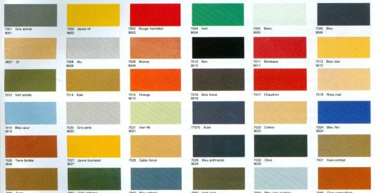

Cette page se propose de lister les teintes de carrosseries officielles (présentes aux catalogues) des E87-E81-E82-E88.

## 300 - AlpinWeiss III

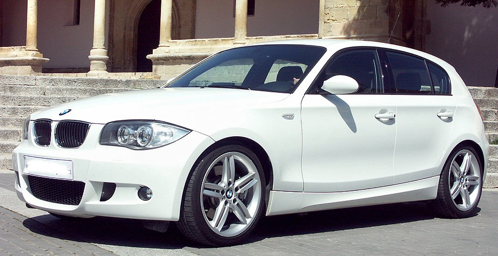

## 354 - Titansilber

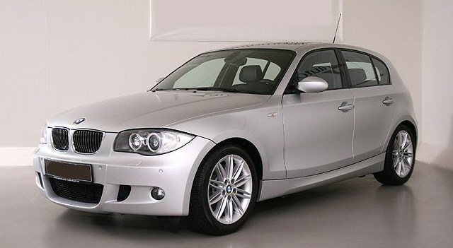

## 381 - Le Mans Blau

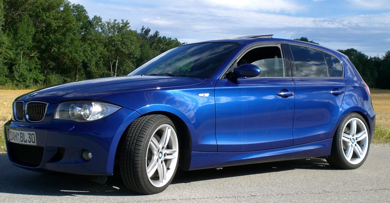

Spécifique Pack M / Sport Design uniquement

## 416 - Carbonschwarz

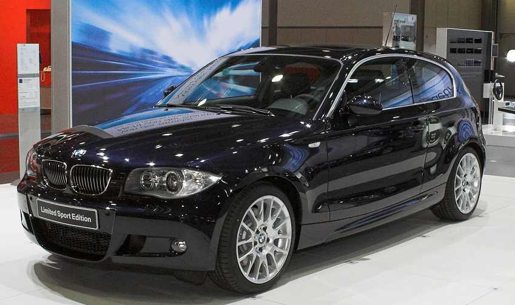

Spécifique Limited Sport Edition (LSE) uniquement

## 438 - Japanrot

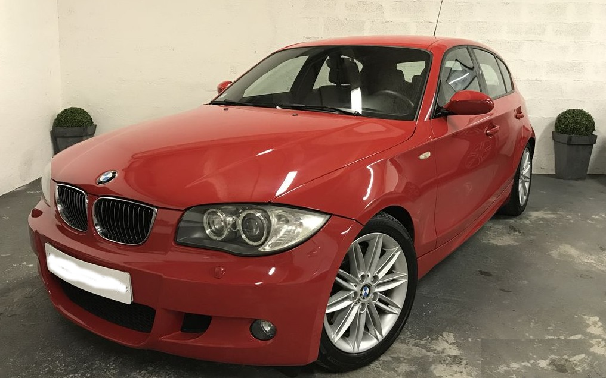

E87 Phase 1 uniquement

## 475 - Saphirschwarz

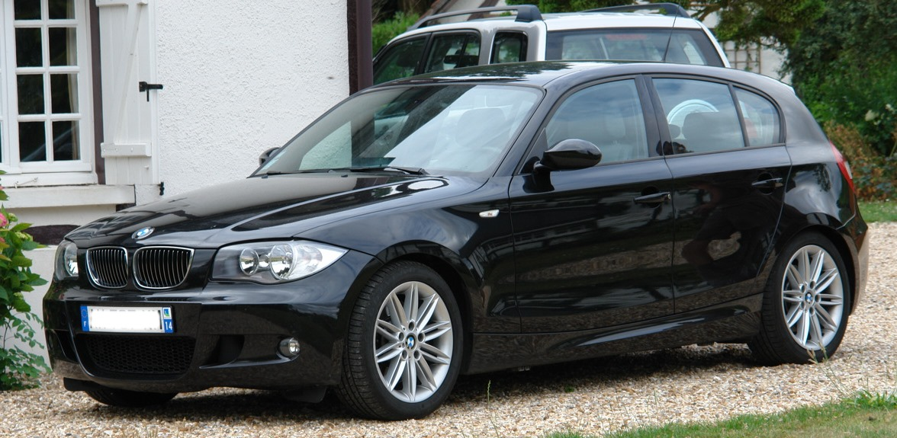

## A18 - Quartz Blau

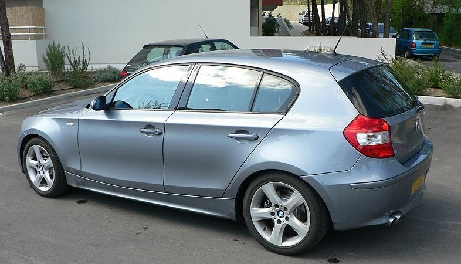

## A21 - Nautikblau

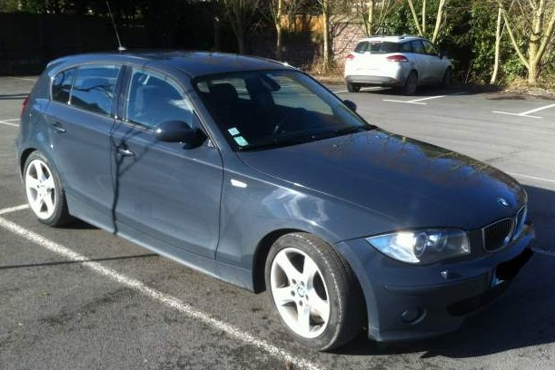

E87 Phase 1 uniquement

## A22 - Sparkling Graphit

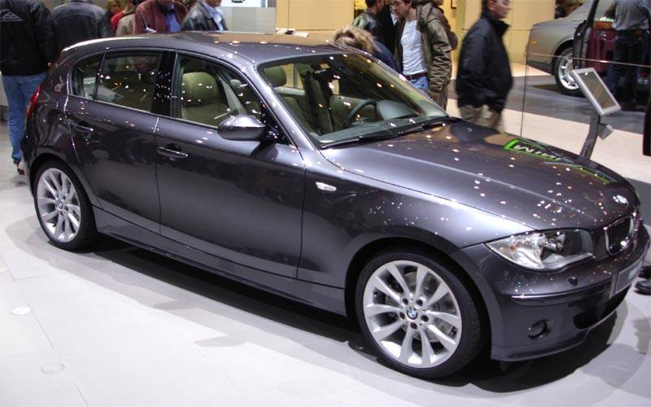

## A23 - Sonora

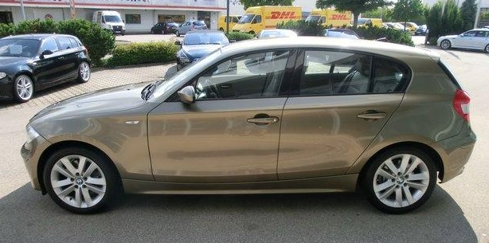

E87 Phase 1 uniquement

## A35 - Monaco Blau

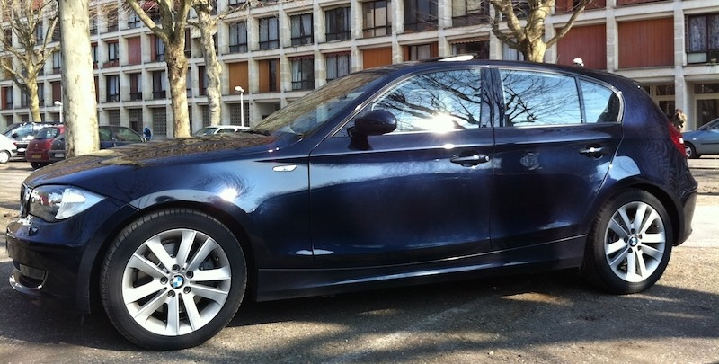

## A51 - Montego Blau

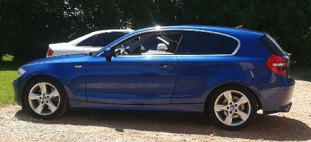

A partir de phase 2 (2007)

## A61 - Karmesinrot (Crimson Red)

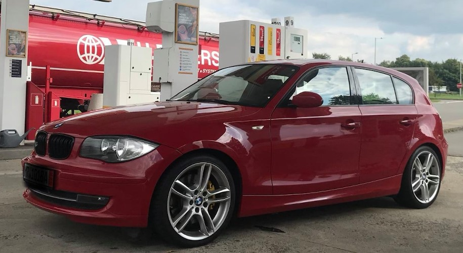

A partir de phase 2 (2007)

## A76 - Tiefseeblau

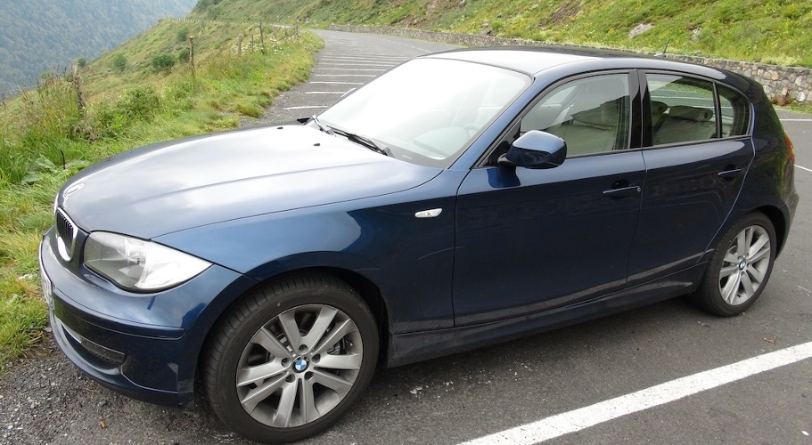

## A52 - Spacegrau

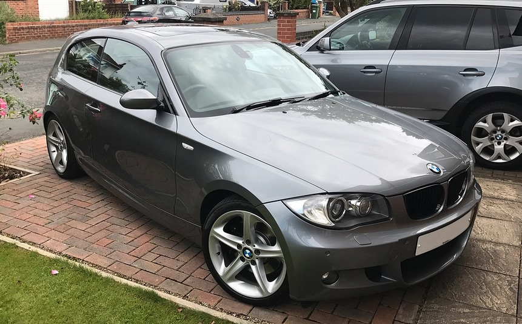

A partir de phase 2 (2007)

## A19 - Sydneyblau

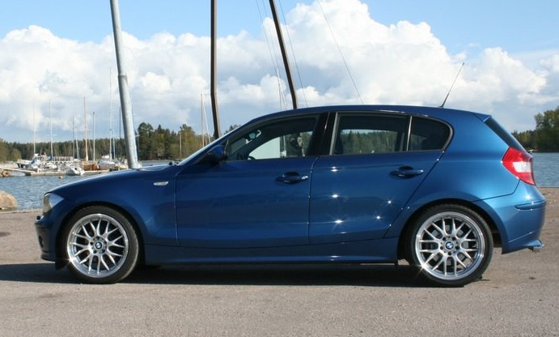

E87 Phase 1 uniquement - jamais vu en 130i

## A17 - Havanna

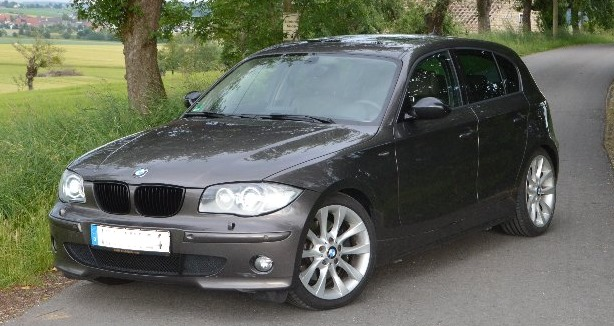

## A78 - Tahitigrün

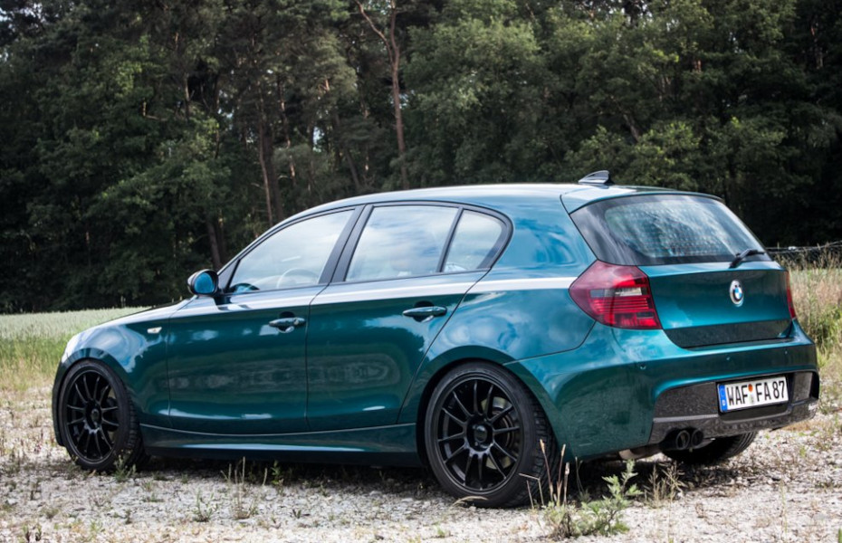

A partir de Phase 2, ultra rare  - jamais vu en 130i

## A71 - Patagoniagrün

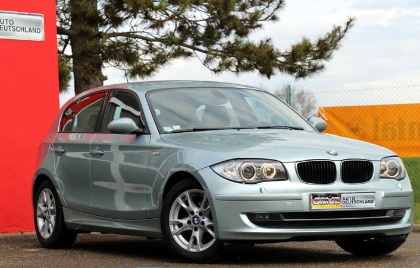

A partir de Phase 2, ultra rare  - jamais vu en 130i

## B09 - Marrakeschbraun

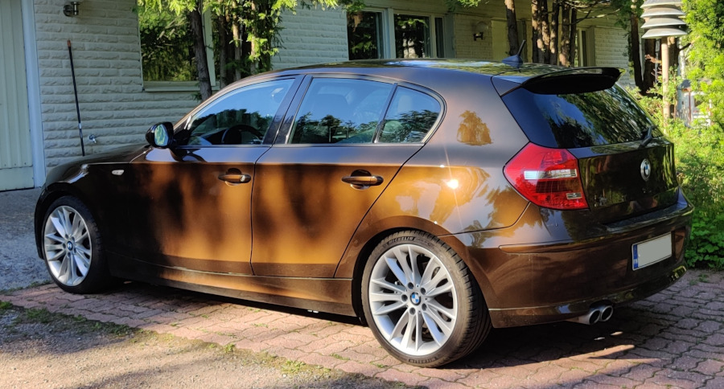

A partir de Phase 2, ultra rare  - jamais vu en 130i

## 896 - Bluewater

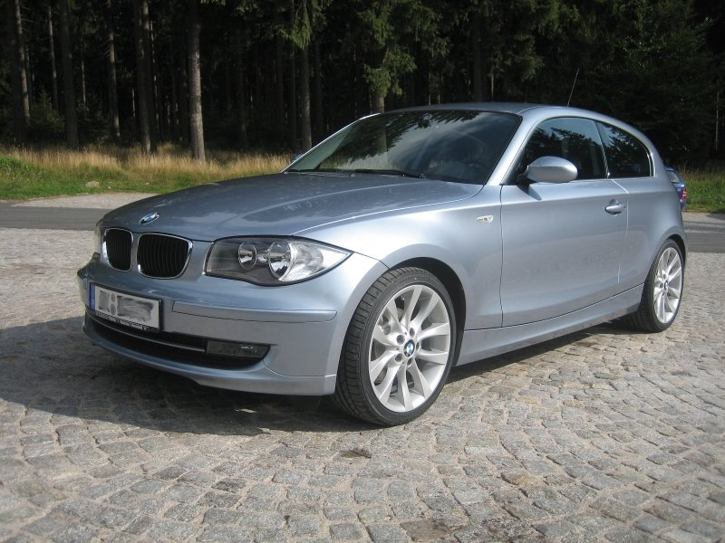

A partir de Phase 2, rare  - jamais vu en 130i
