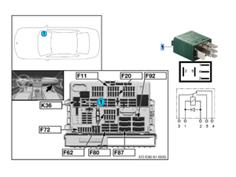
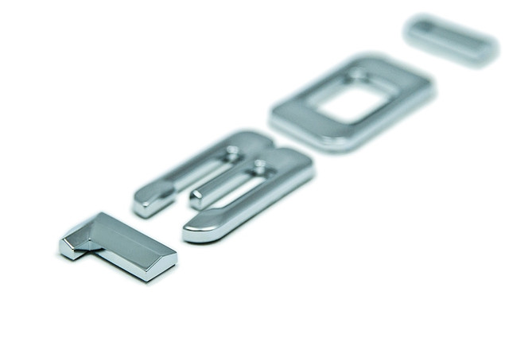
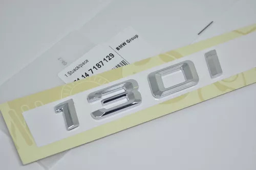
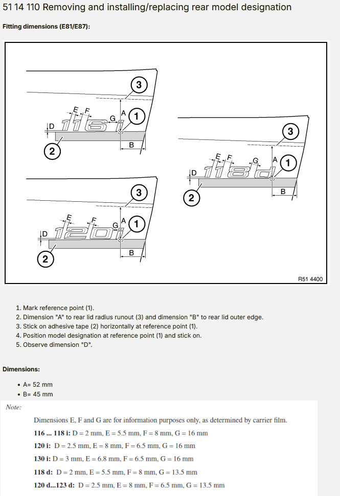
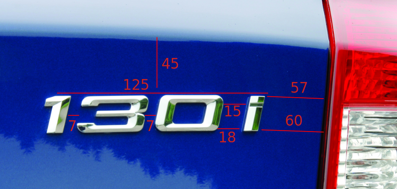

# Trucs et astuces

## Les schémas de pièces

- La référence [RealOEM](https://www.realoem.com/bmw/partgrp.do?model=UF91&mospid=48927&hg=51)
- [Bmw Fans](http://bmwfans.info/parts-catalog/E87N/Europe/130i-N52N/L-N/jan2006/browse)

## Les tarifs des pièces

Pour se faire une idée approximative des tarifs BMW consulter <https://www.leebmann24.de/> ou <https://www.hubauer-shop.de/fr/> et taper la référence de la pièce dans la zone de recherche.

Si la pièce n'est pas trop spécifique, on peut également essayer sur <https://www.auto-doc.fr/> ou <https://www.oscaro.com/>

## Problème E87 Phase 1 : blocage intempestif des essuies-glaces

Au niveau de la boîte à fusibles, au fond de la boîte à gants, il faut remplacer le relais bleu `61 36 6 918 816` par un nouveau relais vert `61 36 6 980 177` (16.07€ HT en 2012).

## Comment recoller un emblème arrière "130i" non présent ?

Dans quels cas ?

- Décollé par un ancien propriétaire
- Présence de l'option **S320A Omission sigle**

- Acheter la pièce de référence `51 14 7 151 387` (tarif +/- 50€ neuf)
- Suivre les préconisation du "TIS" : [_51 14 110 Removing and installing/replacing model designation_](https://workshop-manuals.com/bmw/1_series_e87/130i_n52_5-door/2_repair_instructions/51__body_equipment_(5-door)/14__bmw_emblems_model_emblems/4_ra__removing_and_installing_replacing_rear_model_designation/)

- ...ou utiliser le schéma suivant pour le positionnement :

## Quelques codes couleurs utiles

- **A97** : Diffuseur arrière Pack M : **SCHIEFERGRAU** (= gris ardoise)
- **668** : Shadow Line : **GLANZSCHWARZ** (= Noir brillant)
- **5002** : Bleu clair du logo ///M
- **4000** : Bleu violet du logo ///M
- **353** : Rouge du logo ///M
- **A44** Couleur jantes grises E8X, F2X **Reflexsilber**
- **A55** Couleur jantes 216M, 261M, 359M, grises : **Dekorsilber**
- **A80** Couleur jantes anthracite 261M, 269, 313M, 361 **Ferric Grey** / **Ferricgrau**
- **B55** Couleur jantes anthracite F2X **Ferric Grey 2**
- **B20** Couleur jantes F2X 383M, 386M **Dekorsilber 2**
- **445** Couleur étriers Performance **Phoenix Gold Metalic** (Teinte M3 E46)
- **472** Couleur étriers 135i **Sterlinggrau**

---
:point_left: [Retour au sommaire](../README.md#sommaire)
