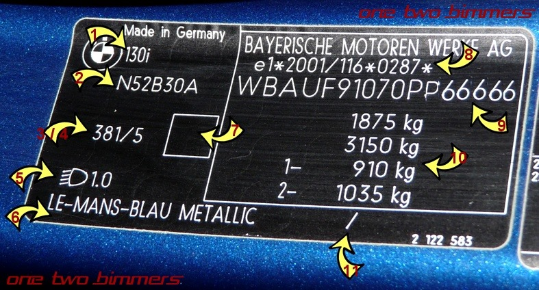
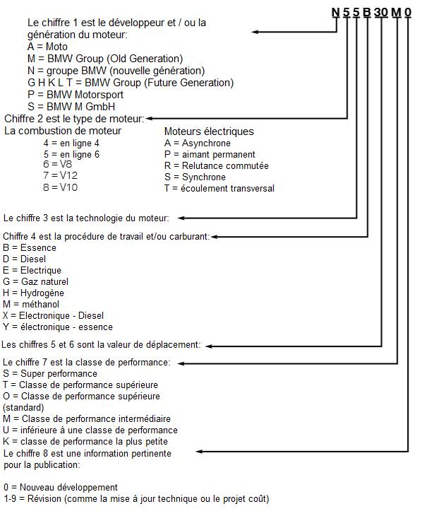

# [FAQ] Tout savoir sur son véhicule à l’aide du VIN

## VIN ?

VIN est l'anagramme de "**V**ehicle **I**dentification **N**umber". L'étiquette VIN (prononcer "vine") est située dans l'ouverture de portière côté conducteur.

Le VIN est formé de 17 caractères et est décomposé comme suit :

Les 3 premiers caractères sont soit WBA ou WBS avec :

- W = Allemagne
- B = BMW
- A = BMW-AG
- S = Motorsport GMBh

Les 4 caractères suivant représentent le code du modèle (une partie du "type mines" figurant sur la carte grise). Exemples : UF91 (E87 phase 1), UD51 (E87 phase 2.x), UB11 (E81) pour la 130i.

Le 8ème caractère donne une info sur la sécurité (ceintures, airbags, ...) :

- 0=Seat Belts
- 1=Seat Belts and Driver Airbag
- 2=Seat Belts and dual airbags
- 3=Seat Belts, Second generation dual front airbags
- 4=Seat Belts, Dual-stage advanced front airbags

Le 9ème caractère est un caractère "de contrôle".

Le 10ème caractère est généralement un "0" pour les modèles "Européens"  (sauf 1M apparemment) ou à défaut il correspond à l'année du modèle :

- 1=2001,2=2002,,3=2003, ...
- A=1980,B=1981,C=1983, ..., Y=2000
- A=2010,B=2011,C=2012, ...,

I, O, Q, U, Z ne sont pas utilisés.

Le 11ème caractère correspond à l'usine de fabrication :

- A/F/K : Munich
- B/C/D/G : Dingolfing
- E/J/P : Regensburg
- V : Leipzig
- H/N : Rosslyn (Afrique du Sud)
- L/M : Spartanburg (USA Caroline du Sud)
- W : Graz (Autriche)

Les caractères 12 à 17 représentent un numéro séquentiel de production.

## L’étiquette

1. Évidemment le modèle : 130i, 120d, ...
1. Le code moteur (voir détail plus loin)
1. Le code couleur (voir cette fiche)
1. Vide ou ???
1. ???
1. Le nom de la teinte de carrosserie
1. Vide pour les modèles essence, coefficient d'absorption des fumées pour les modèles diesel (merci à Corbac pour l'info)
1. Correspond au champ "K" (réception communautaire) de la carte grise (voir ce lien <http://www.carte-grise.org/nomenclature/K-numero-reception-type.php>)
1. Le VIN  (voir détail au chapitre 3)
1. Masses : PTAC (champ F2 CG) , Poids total roulant autorisé (champ F3 CG), 1-  Poids maximal autorisé sur l'essieu avant, 2- Poids maximal autorisé sur  l'essieu arrière
1. Vide ou couleur de ???

## Nomenclature des moteurs BMW

## Informations et équipement d’origine du véhicule

A partir des 7 derniers caractères du VIN on obtient le numéro de châssis. A partir de ce code on peut récupérer toutes les informations du véhicules : date de production, - usine de fabrication, équipement et options d’origine.

Essayer les différents sites suivants :

- ETK : <http://www.etk.cc/bmw/language/FR/>
- BMW VIN Decoder : <http://www.bmw-z1.com/VIN/VINdecode-e.cgi>
- BMW Fans :  <http://fr.bmwfans.info/>
- Free BMW VIN Decoder : <https://www.mdecoder.com/>
- BMW  VINDECODER : <https://decoder.bvzine.com/>
- BimMer.Work : <http://bimmer.work/vin/>

**(i) liens morts potentiels, la plupart des sites "historiques" ayant été fermés**
