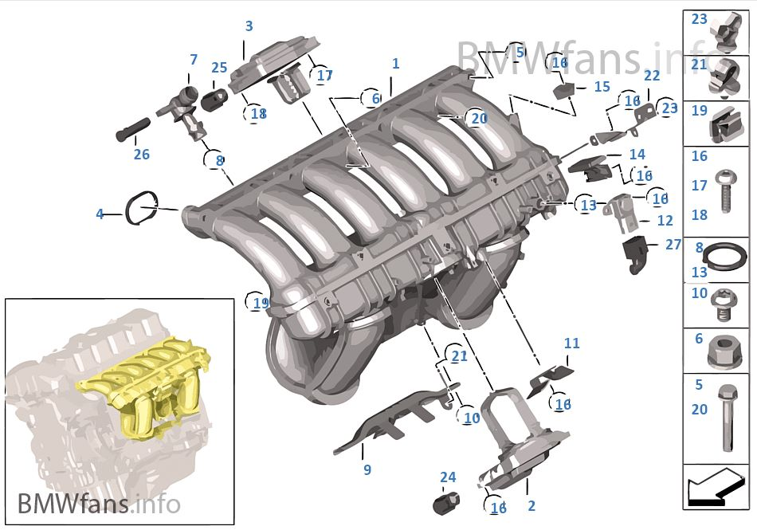

# [FAQ] Les valves DISA

Ces valves (ou actionneurs) sont au nombre de 2 et se situent sur le collecteur d’admission et sont utilisées par le système d’admission variable à 3 niveaux...afin de fournir un couple élevé également dans la gamme de vitesse moyenne du moteur.

DISA signifie _Differential Intake System Adjuster_ valve

[Schéma](http://fr.bmwfans.info/parts-catalog/E87/Europe/130i-N52/L-N/jan2006/browse/engine/intake_manifold_system/)

==> Pièces 2 et 3

Ouvertes l’arrêt, elles se ferment au démarrage du moteur (ralenti) pour se rouvrir ensuite en fonction des valves et du régime moteur.

## Les situer

- DISA 1 (la petite - pièce N°3) est installée dans le collecteur d'air d'admission avant le canal d'admission résonnant et est difficilement accessible (obligation de dépose du collecteur ou de l’alternateur).
- DISA 2  (la grosse - pièce N°2) est installée dans le tuyau de débordement, est plus simple d’accès derrière la boite à air.

## A quoi ça ressemble en vrai ?

Pièces de remplacement non-OEM :

La grosse valve avec un petit "socle" (celle visible) - Vue N°1 :

La grosse valve avec un petit "socle" (celle visible) - Vue N°2 :

La petite avec un plus gros "socle" (celle cachée) :

## Exemples de valves cassées

## Références et tarifs indicatifs

- DISA INT / BAS : `11 61 7 560 538` (petite) - 245.32 € (Fabriquant MAHLE Ref `ESK 002`)
- DISA EXT / HAUT : `11 61 7 579 114` (grosse) - 245.32 € (Fabriquant MAHLE Ref `ESK 001`)
- Joints de collecteur : Jeu joints de profil `11 61 7 547 242` - Si dépose du collecteur d’admission le changement des joints est conseillé.
- Si dépose de l’alternateur : Jeu de vis alu `12 31 0 392 568`

## Liens commerciaux

- [maXpeedingRODS - la grande](https://fr.maxpeedingrods.com/product/for-bmw-e87-e81-e90-e60-left-11617522929-air-intake-manifold-flap-adjuster-valve.html)
- [Amazon - la grande](https://www.amazon.fr/dp/B07BSZM1LD?ref=ppx_pop_mob_ap_share)
- [Amazon - les 2](https://www.amazon.fr/valves-INTAKE-MANIFOLD-11617579114-11617560538/dp/B07PY2NL6T/ref=pd_sbs_263_1/261-7187806-2591612)

Kits de réparation :

- <https://www.i6automotive.co.uk/aluminium-repair-kit-disa-intake-aduster-bmw-engine-n51-n52-n52n-n52k-large-v.html>
- <https://www.i6automotive.co.uk/aluminium-repair-kit-disa-intake-aduster-bmw-engine-n51-n52-n52n-n52k-small-v.html>

Hubauer-shop.de (Concession allemande) :

- <https://www.hubauer-shop.de/fr/advanced_search_result.php?categories_id=0&keywords=11+61+7+560+538&inc_subcat=1>
- <https://www.hubauer-shop.de/fr/advanced_search_result.php?categories_id=0&keywords=11+61+7+579+114&inc_subcat=1>

Oscaro (ex: Febi Bilstein) :

- La grande <https://www.oscaro.com/fr/search?q=11%206%2017%20579%20114>
- La petite <https://www.oscaro.com/fr/search?q=11%2061%207%20560%20538>

## Codes erreurs, symptômes et risques

Peut provoquer le code erreur suivants :

- 2AA8
- 2AA9
- 2AAB

Les symptômes possibles :

- Ralenti instable
- Perte de puissance
- Non joignable et contrôlable via INPA
- "Broutage" si on conduit de bas regime vers haut regime

Risque majeur : **casse moteur** si la pièce détériorée fini dans les soupapes.

## Démontage

### Pour la grande

Torks T25 + tournevis plat

- Démonter la boite à air
- Dévisser le bocal de liquide de DA (pour les modèles équipés de direction hydraulique).
- Démonter la pate métallique (N°11)

Tuto anglais : [Sur Z4](https://z4-forum.com/forum/viewtopic.php?f=30&t=36349)

### Pour la petite

- Démonter le boîtier papillon
- Démonter l’alternateur (il faudra remonter avec les 4 vis alu neuves au couple prescris)
- Les 3 vis torks (2 petites + 1 grande) sont du même côté que la grande DISA

Vidéo de démontage via la dépose de l’alternateur : <https://www.youtube.com/watch?v=g6MEvL_xXO4>

## Conseils

Au moins pour la grosse valve, la plus accessible des 2, essayer de la contrôler régulièrement à partir de 150 000 Kms.

Il faut absolument éviter que des morceaux cassés (notamment l’axe métallique) se retrouve dans l’admission et finisse par endommager le moteur.

## Quelques liens pour approfondir le sujet

- [Le DISA - by TontonGreg](https://www.tontongreg.fr/bmw-disa/)
- [Chapitre DISA sur l’article “le moteur N52”](https://www.forumbmw.net/topic-143-le-moteur-bmw-n52.html)
- [Diagnosing a Failing BMW DISA Valve – Sypmtoms, Problems & Repairs](https://bmwtuning.co/failing-disa-valve/)

---
:point_left: [Retour au sommaire](../README.md#sommaire)
