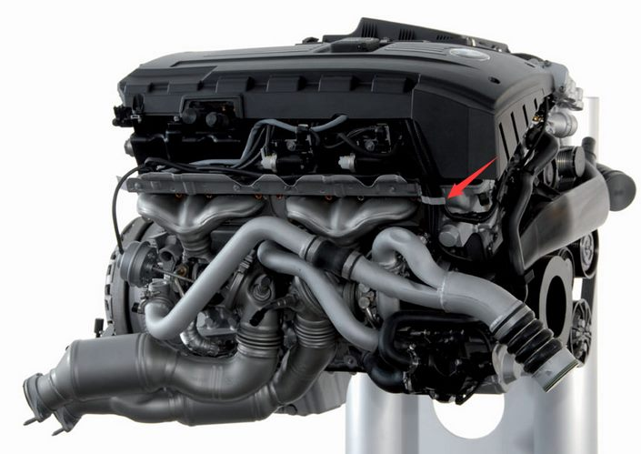
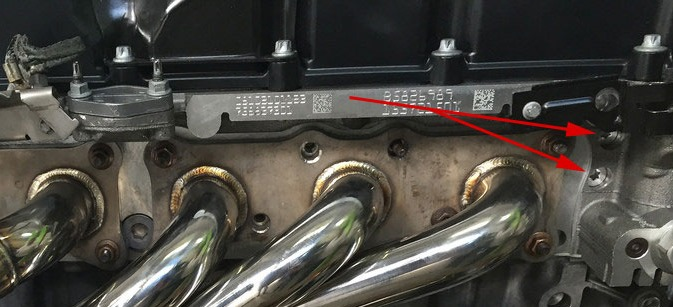
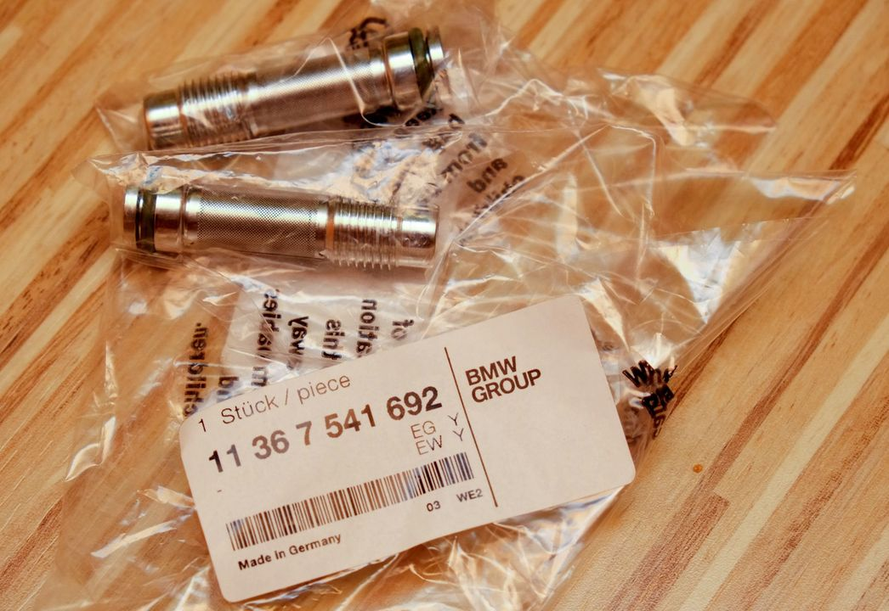
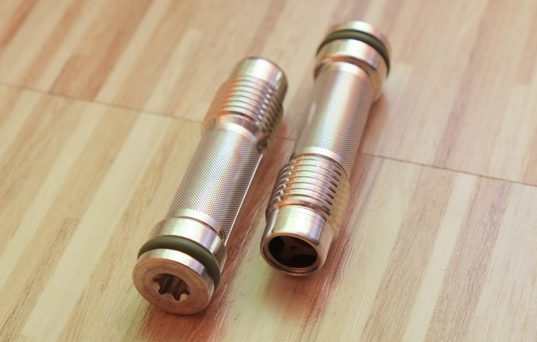
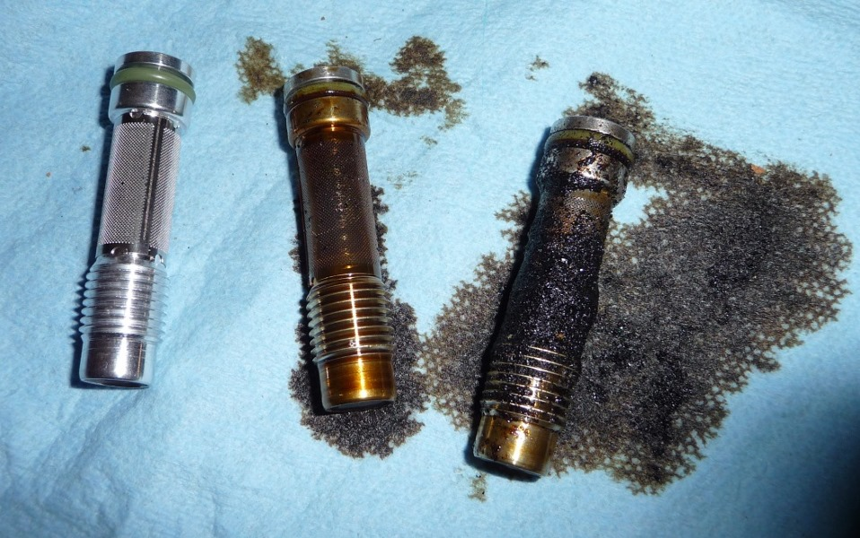
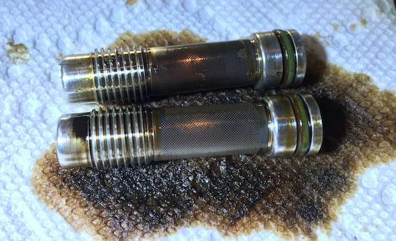

# [FAQ] Vanos : les valves anti-retour

Ces valves au nombre de 2 sont souvent appelés “filtres” car elles ressemblent à des ... filtres. Il peut apparaître parfois utile de les démonter pour les nettoyer ou les changer.

## Les situer

Sur le coté gauche du moteur, à l’avant :

Schéma des pièces : [bmwfans.info](http://fr.bmwfans.info/parts-catalog/E87/Europe/130i-N52/L-N/jan2006/browse/engine/cylinder_head_attached_parts/)

## Informations utiles

- Référence : Valve anti retour `11 36 7 541 692` => x2
- Référence : Joint torique `11 36 7 507 729` => x2, déjà inclus avec les valves mais vendu au détail si besoin.
- RealOEM : <https://www.realoem.com/bmw/fr/showparts?id=UF91-EUR-01-2006-E87-BMW-130i&diagId=11_3735>

## Tarifs

Meilleur tarif trouvé chez BMW (tarif ci-dessous en concessions de Montauban et Toulouse): 21,02€ /pièce.

Sur le net, les tarifs tournent autour de 35€ /pièce.

## Démontage

- Embout Torks **T40** + rallonge
- Couple de serrage **13-15 Nm**

Suivre la vidéo de Fab.b sur [YouTube](https://www.youtube.com/watch?v=1PjQfJqkYpc)

... ou un [tuto en Anglais](https://www.e90post.com/forums/showthread.php?t=1096694)

**(i)** L’accès n’est pas forcément évident. Dans le doute ne pas y toucher.

## Photos une fois démontés

Différents états ...

## Nettoyage

WD40,  nettoyant freins, ...

## Remontage

**_ASTUCE :_** Penser à huiler les joints.

---
:point_left: [Retour au sommaire](../README.md#sommaire)
