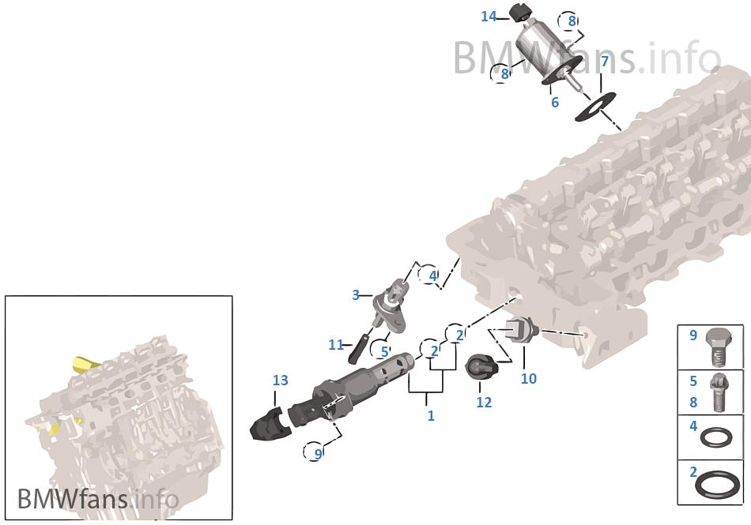
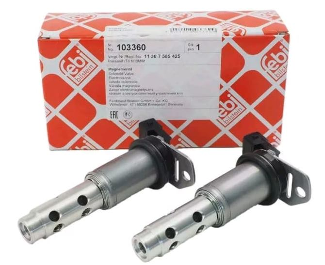
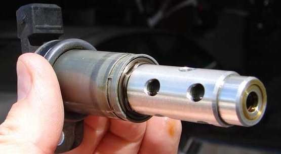
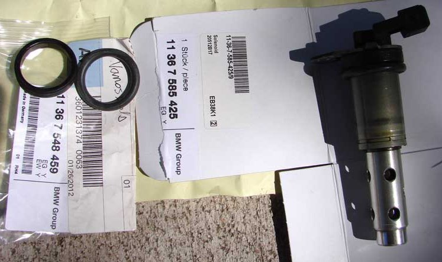
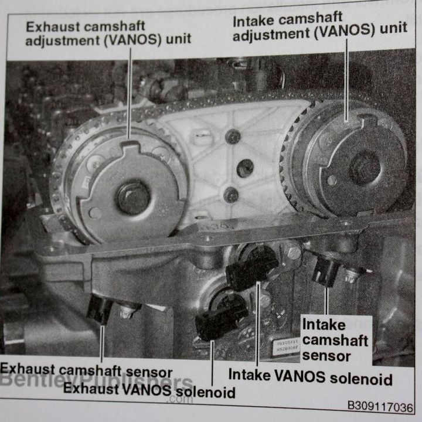
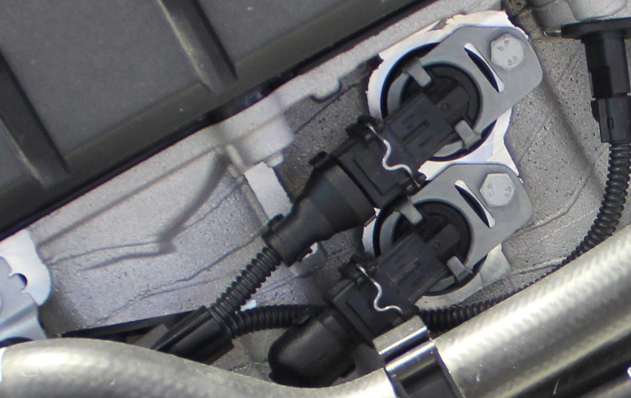

# [FAQ] Vanos : les électrovannes

Les unités VANOS sont contrôlées par la pression d'huile à partir des électrovannes. Elles sont parfois appelées "Solénoïdes".

## Les situer

<http://fr.bmwfans.info/parts-catalog/E87/Europe/130i-N52/L-N/jan2006/browse/engine/cylinder_head_electr_add_on_parts/>

## A quoi ça ressemble ?

## Information utiles

Tarif :

- environ 100€ pièce (137€ /pièce constaté à Toulouse et Montauban)-
- 80€ /pièce pour des modèles PIERBURG sur OSCARO (voir lien plus bas)

Référence électrovanne BMW : `11 36 7 585 425`

Référence joints toriques (x2) BMW : `11 36 7 548 459`

- En haut : solénoïde d'admission
- En bas : solénoïde d'échappement

## Symptômes

- voyant moteur orange  (voir les codes d’erreurs ci-après)
- ralenti instable
- montées en régime avec variations de couple, agrément dégradé même à mi-charge

## Démontage

**Outils :** Douille de 10, cliquet, clef dynamométrique

**Couple :** 9Nm

**Procédure :**

- Démonter l’arriver d’air (2x 2 vis au niveau de la calandre) pour faciliter l’accès
- Démonter les prises électriques (appuyer sur la tige métallique)
- Dévisser les écrous de 10
- Bien retirer les joints toriques qui restent dans le logement de la culasse
- Nettoyer au nettoyant freins ou WD40 + un éventuel coup de soufflette
- Huiler les joints toriques avant le remontage

> On remarque des connecteurs différents entre l'admission (droit en haut) et l'échappement (coudé en bas) pour éviter de se tromper lors du remontage.

## Liens commerciaux

- [OSCARO](https://www.oscaro.com/valve-de-commande-reglage-darbres-a-came-pierburg-7-06117-01-0-10008239-3826-p)
- [Leebmann](https://www.leebmann24.de/magnetventil-1er-3er-5er-6er-7er-x1-x3-x5-x6-z4-11367585425.html)

## Vidéos exemples

- [BMW N52 Vanos Solenoids Removal & Renewal](https://www.youtube.com/watch?v=HBctrWUIY5o)
- [How to Clean Your Vanos Solenoids N52 motor](https://www.youtube.com/watch?v=oB2DIfBX8R8)

## Codes d’erreurs possibles

- 2A9A Intake cam sensor signal invalid for synchronization.
- 2A82 Intake Vanos stiff or mechanically jammed.
- 2A98 DME: Vilebrequin - arbre à cames d'admission, référence (Intake camshaft to crankshaft correlation outside of reference range.)
- 2A9B Exhaust cam sensor signal invalid for synchronization.
- 2A99 DME: Vilebrequin - arbre à cames d'échappement, référence (Exhaust camshaft to crankshaft correlation outside of reference range.)
- 2A87 Exhaust Vanos stiff or mechanically jammed.

---
:point_left: [Retour au sommaire](../README.md#sommaire)
