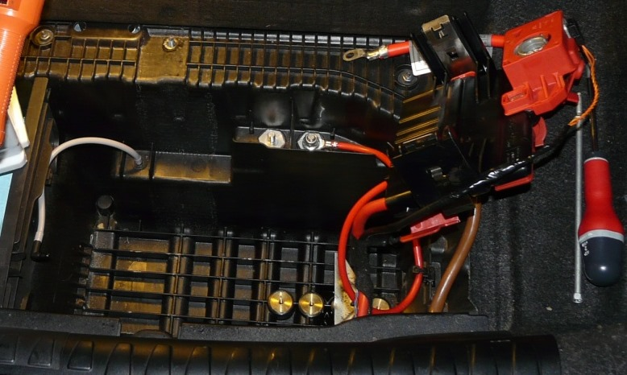

# [FAQ] Remplacement de la batterie

## Les caractéristiques d'une batterie

3 chiffres expriment les caractéristiques d’une batterie :

- Le premier chiffre exprimé en **Volt** est la tension (de base) : 12V en réalité 12,6 V.
- Le deuxième chiffre exprimé en **Ampère par Heure** est la capacité de la batterie.
- Le troisième chiffre exprimé en **Ampère** est sa capacité au démarrage.

**/!\\ IMPORTANT** Il est fondamental lors d'un remplacement que les caractéristiques de la nouvelle batterie soient au moins égales à celles de la batterie d'origine, celles-ci peuvent pour un même véhicule dépendre notamment du nombre d'options initiales du véhicule.

## Localisations

Sur la génération E8X la batterie est située dans le coffre côté milieu-droit :

Sous le capot moteur se trouve une borne "+" et une masse pour  pouvoir y brancher des câbles si besoin de démarrer avec un autre véhicule (voir pages 107 et 108 de votre manuel) :

## L'IBS

La présence de l'IBS (**Intelligent Battery Sensor**) se détecte facilement, c’est un petit module noir situé au niveau du câble qui se fixe sur la cosse négative de la batterie.

La présence de l'IBS est un élément qui peut indiquer le besoin d’une reprogrammation à chaque changement de batterie.

(cosse simple = pas d'IBS)

(cosse avec boîtier noir = présence d'IBS)

## Batterie AGM vs Batterie classique

Les batteries classiques (plomb-acide liquide) sont les batteries les plus communes, vous noterez sur celles-ci, la présence d’un témoin d’état (chargée/déchargée/à remplacer), indicateur (3) sur la photo.

Avec l'apparition des systèmes Start-Stop et chez BMW des technologies "_Efficient Dynamics_" des batteries **AGM** (_Absorbed Glass Mat_)  sont désormais utilisées. Celles-ci sont par contre beaucoup plus chères que les batteries classiques. **Une reprogrammation sera dans ce cas toujours nécessaire**.

**(i) Astuce :** Pour les reconnaître visuellement, chez BMW les batteries classiques sont **normalement** de couleur blanche et les AGM de couleur noire.

**(i) Astuce :** Vous noterez que sur la borne "-" apparaissent la semaine et l'année de fabrication. Exemple : "47 - 10", voir l'indicateur (2) sur la photo.

## Symptôme de batterie complètement HS ou déchargée

- Démarreur qui ne se lance pas
- Voyants au tableau de bord, voir effet “sapin de Noël” (plein de voyants)
- Impossible d'ouvrir le coffre
- La condamnation via les clefs et le bouton intérieur ne marche plus
- Pas de phares, de radio, etc.

## Schémas et informations techniques officielles

- [Batterie pleine d'origine BMW](http://fr.bmwfans.info/parts-catalog/E87/Europe/130i-N52/L-N/jan2006/browse/vehicle_electrical_system/original_bmw_battery_warranty_only/)
- [Fixation batterie et pièces amovibles](http://fr.bmwfans.info/parts-catalog/E87/Europe/130i-N52/L-N/jan2006/browse/vehicle_electrical_system/battery_holder_and_mounting_parts/)
- [Câble batterie/répartiteur électrique ar](http://fr.bmwfans.info/parts-catalog/E87/Europe/130i-N52/L-N/jan2006/browse/vehicle_electrical_system/battery_lead_distribution_box_rear/)

## Tuto pour le remplacement

### Les outils nécessaires

- Clef à pipe ou cliquet de 10mm
- Clef à pipe ou cliquet de 13mm
- Tournevis plat
- Lampe type baladeuse

### Les étapes du démontage

- Enlever la partie centrale du tapis de coffre.
- Fixer votre lumière d’appoint type baladeuse pour y voir bien clair.
- On commence par enlever le petit cache plastique noir, il suffit de le pousser dans le sens de la flèche verte.

- On peut ensuite accéder au 2ème écrou permettant d’enlever la grande traverse noire.
- Dévisser les 2 écrous de la traverse noire (**_Clef à pipe/cliquet de 10_**) :

- Dévisser la borne "-" (**_Clef à pipe/cliquet de 10_**) :

- Isoler le câble avec un chiffon, une vieille chaussette, etc. :

- Dévisser l'écrou (**_Clef à pipe/cliquet de 13_**) :

- Ouvrir le clapet et dévisser la borne"+" (**_Clef à pipe/cliquet de 10)_** :

- Avec le **_tournevis plat_** il faut déclipser les 2 accroches :

_Pour chacune des accroches :_

- Placer le tournevis en butée au niveau de la flèche verte et dans un même geste appuyer et pousser vers l’extérieur.
- Un clic doit s’entendre.

Puis :

- Sortir le gros bloc rouge incluant la cosse positive :

- Tirer sur le reniflard de vapeurs d'acide pour le désolidariser de la batterie :

- Dévisser la longue vis qui bloque la batterie dans le bac (**_tournevis cruciforme ou clef/cliquet de 10_**) :

- Enlever la tige, et la pièce métallique au fond.
- Enfin, sortir la batterie.

### Le remontage de la nouvelle batterie

Le remontage s’effectue évidemment bien sur dans l’ordre inverse.

3 astuces néanmoins :

- Pour refixer sur la batterie le gros bloc rouge associé à la cosse positive il suffit d’appuyer sur les 2 zones métalliques jusqu’à entendre le clic (elles doivent s’incliner légèrement).
- Pour refixer la traverse noire, bien que cela ne soit pas très important, essayer de respecter le « bon sens » (on ne fait pas attention lors du démontage mais il y a bien un sens).
- Toujours terminer par la cosse négative.

**(i)** Une fois la batterie changée (ou rebranchée) il suffira uniquement de régler l'horloge (les données kilométriques et conso de l'ODB seront néanmoins réinitialisées).

## Quelques batteries compatibles

| Origine | Remplacement |
|---------|--------------|
| 70Ah 570A | VARTA Blue E11 74Ah 680A |
| ? | VARTA F21 AGM |

---
:point_left: [Retour au sommaire](../README.md#sommaire)
