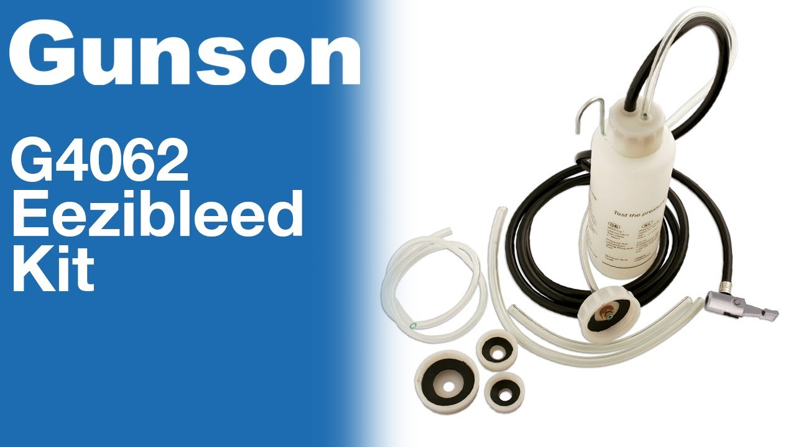
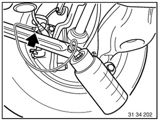

# [TUTO] Remplacement du liquide de frein avec Gunson eezibleed

## Outillage nécessaire

- 500ml de liquide frein **DOT 4** (exemple : Motul RBF 600)
- **Gunson eezibleed**
- Roue de secours entre 1 et 1,4 bar
- Clef de 9 et 11 pour les vis de purge des étriers
- Clef à pipe de 7 pour visser le bouchon eezibleed
- 1 seringue
- Durite transparente et bocal

## Étape 1 : Préparation

- Appuyer plusieurs fois sur la pédale pour chasser d’éventuelles bulles.
- Retirer un maximum de l’ancien liquide du bocal avec une seringue.
- Re-pomper à la pédale pour mettre sous pression

## Étape 2 : Branchement du système de purge

1. Choisir le bouchon de l’eezibleed adapté au bocal (clef de 11 pour visser).
2. Serrer le bouchon aux doigts sans forcer trop.
3. Vérifier la pression de la roue de secours  < 1,5 bar (15PSI = 1 bar)
4. Brancher la roue de secours, vérifier s’il y a des fuites au bouchon au niveau du bocal avant de mettre du liquide
5. Débrancher la roue de secours
6. Remplir le réservoir de nouveau liquide
7. Remplir le bocal eezibleed
8. Brancher la roue de secours

**NE PAS OUVRIR LE BOUCHON DU BOCAL QUAND IL EST SOUS PRESSION.**

**_ASTUCE :_** Si besoin de nettoyer suite à une fuite : bombe nettoyant frein + chiffon

## Étape 3 : Purge aux étriers

On procède de la roue la plus éloignée du maitre cylindre à la plus proche : ard/arg/avd/avg.

- Raccorder le tuyau de purge avec le bac collecteur à la vanne de purge sur l'étrier de frein arrière droit.
- Ouvrir la vanne de purge et purger jusqu'à ce que le liquide de frein soit libre et sans bulles.
- Fermer la vanne de purge.

Suivez la même procédure pour :

1. l’étrier arrière gauche,
2. l’étrier avant droit
3. l’étrier avant gauche

## Étape 4 : Fin

- Débrancher la pression.
- Faire attention au trop plein de liquide quand on ouvre le bocal.
- Supprimer le trop plein de liquide du bocal, mettre en dessous du niveau max sur le bocal.

## Étape 5 : Nettoyage

Nettoyer tout le matériel et les tuyaux car le LDF est très corrosif.

## Idéalement à faire aussi

- la purge au niveau de l'embrayage (à côté de de la CDV, près de la boite de vitesses)
- le module ABS

## Vidéos

- [YouTube - Garage, Bagnoles et Rock'n Roll : Tuto](https://www.youtube.com/watch?v=HFiUIaEwSnA)
- [YouTube - Fab B. : Comment purger les freins sur BMW E90](https://www.youtube.com/watch?v=D2OzaTVu6_s)
