# Modification de la CDV

## CDV ?

_Clutch Delay Valve_, sous ce terme barbare se cache une petite pièce en plastique qui a pour effet de réduire le flux de liquide vers l'embrayage et ainsi induire un délai pour embrayer et débrayer. Résultat: un débrayage et un embrayage prenant plus de temps.
L'effet principal est qu'il est du coup difficile de manipuler l'embrayage avec précision, ce qui génère des à-coups, principalement en 1ère et en 2ème, surtout en conduite sportive.

## Pièce et référence

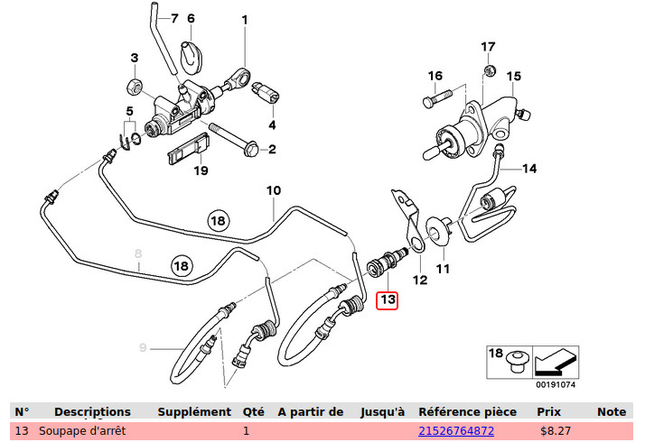

A commander chez BMW une CDV d’origine si vous souhaitez garder de côté une CDV d’origine, sinon modification de la CDV existante sur votre véhicule :

- Référence: `21 52 6 764 872`
- Tarif indicatif : 15€

## Situer la valve

Sous le véhicule, à côté de la boite de vitesses :

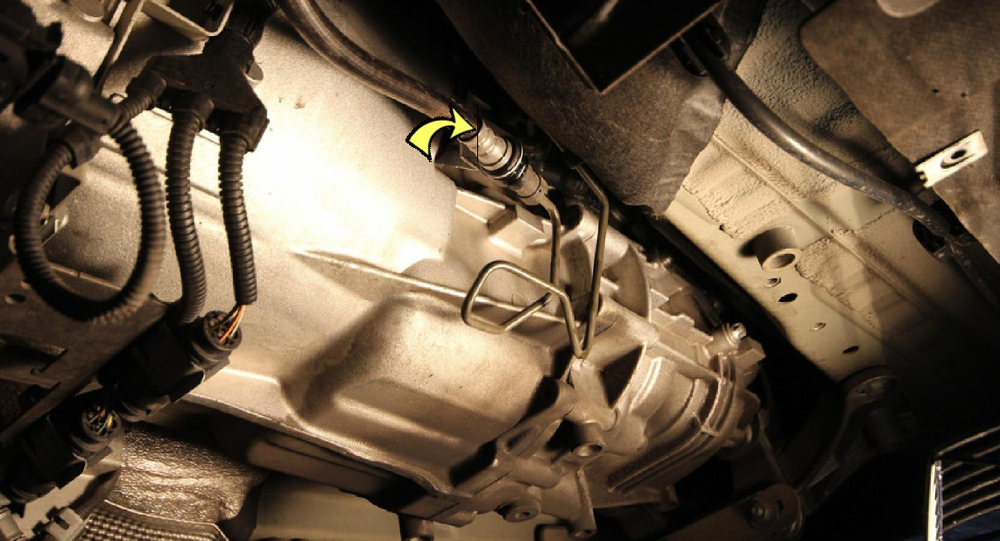

De plus près :

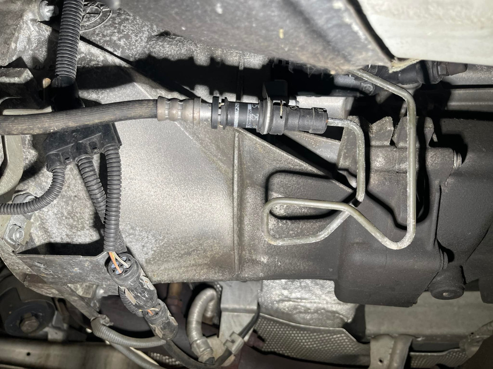

## Le liquide d'embrayage

Comme sur la plupart des voitures actuelles c'est le liquide de frein qui actionne l'embrayage. Il faut bien faire attention à ce que le niveau du bocal soit à ras bord (plus que le niveau max) pour pouvoir ultérieurement faire la purge d’air.

Le réservoir se trouve à gauche au pied du pare-brise sous un cache plastique qui est juste clipsé :

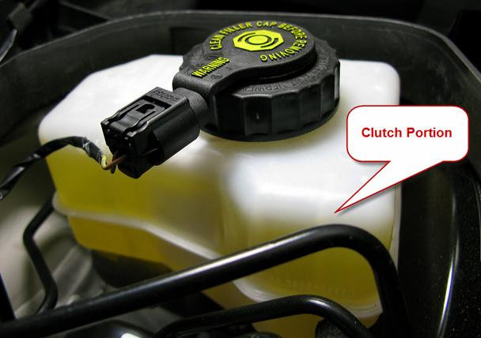

## Démontage de la CDV

En préalable, démonter le gros cache cache plastique qui couvre la boite de vitesse.

Utiliser le serre joint ou une pince spéciale, dite "pince à clamper" (voir photo) pour écraser (un peu, pas trop) la durite de liquide pour éviter que le circuit ne se vide lors du démontage :

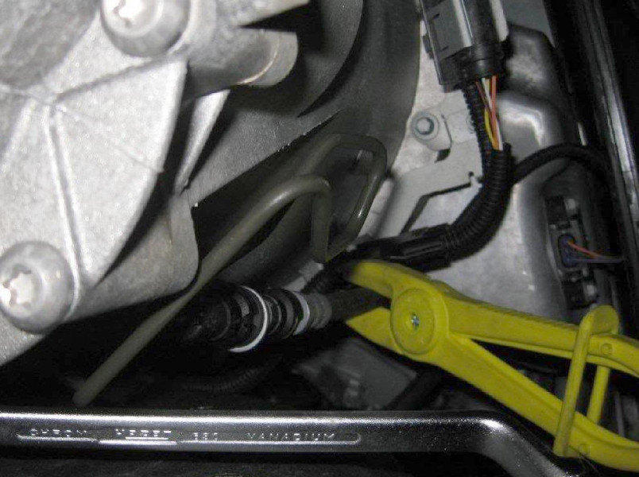

Sortir la CDV est très simple, elle ne tient qu'avec 2 clips métalliques qui se défont avec le petit tournevis plat :

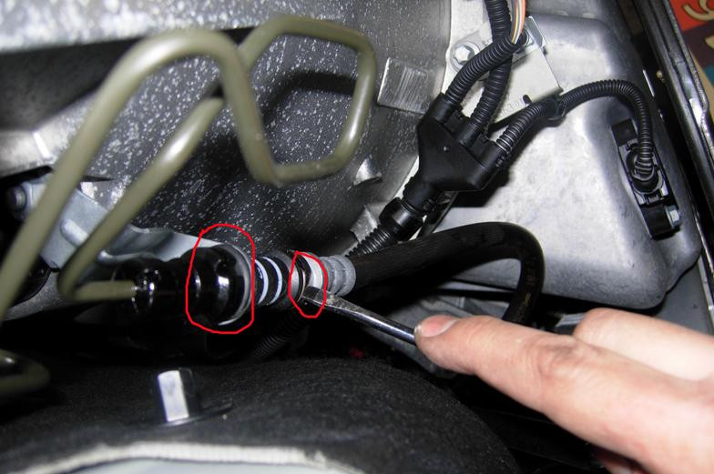

2 clips : Un sur la valve côté durite et un autre côté du conduit menant au récepteur d’embrayage :

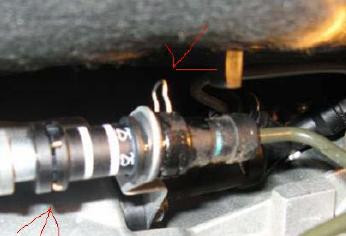

## Modification de la valve

Il y a une bride en plastique dans la CDV qui réduit le diamètre donc le flux de liquide dans un sens comme dans l'autre. Cette bride est fixée par un clip métallique.

Pour sortir la bride il faut introduire du coté fin une clé allen de 3 (ou un poinçon) et taper doucement avec un marteau jusqu'à ce que la bride cède :

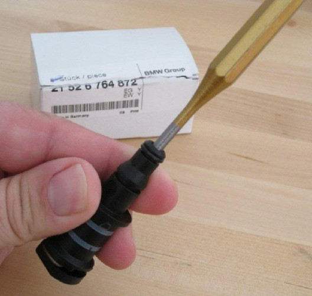 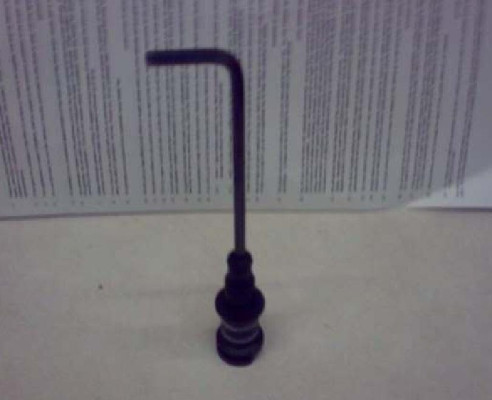

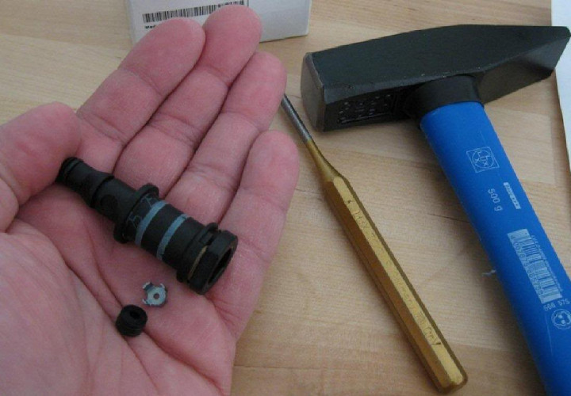 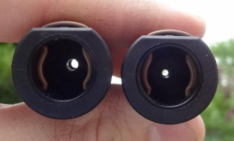

## Remontage

A cette étape vous avez 2 possibilités :

- Rebrancher directement sans CDV
- Remettre la CDV originelle modifiée

:warning: Bien s'assurer ques les clips de rétentions sont bien positionnées.

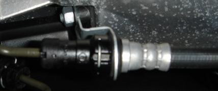
(ici un remontage sans la CDV)

Fin, Enlever le serre-joint ou la pince à clamper.

## Purge du système et appoint

La dernière étape, **la plus importante**, consiste à purger le liquide d'embrayage pour enlever les bulles d'air.

La vis de purge se trouve juste au dessus de la CDV sous un petit cache en plastique sur le cylindre récepteur d'embrayage, pas forcément très accessible :

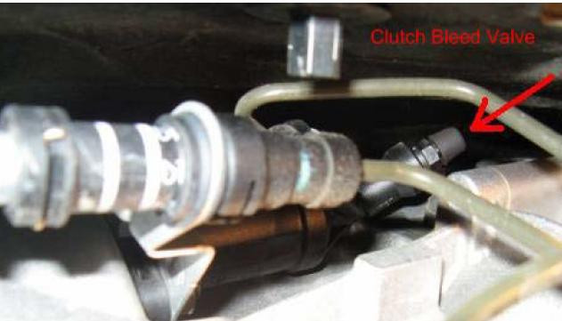

- Enlever le capuchon puis installer le tuyau de purge (durite souple de 3-4mm de diamètre) et desserrer la vis (clef de 11, 3/4 de tour).
- Il ne reste plus qu'à pomper sur l'embrayage (entre 2 et 4 fois) jusqu'à ce que le tuyau soit rempli de liquide sans bulle d'air.

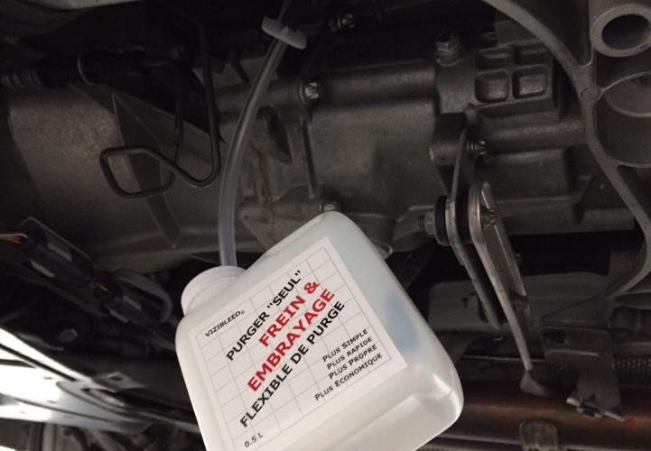

- On referme la vis de purge, on débranche le tuyau, on remet le capuchon (dans cet ordre obligatoirement) et c'est fini.
- On peut remonter le cache plastique.
- Enfin faire l’appoint si besoin au niveau du bocal jusqu’au niveau « max » :

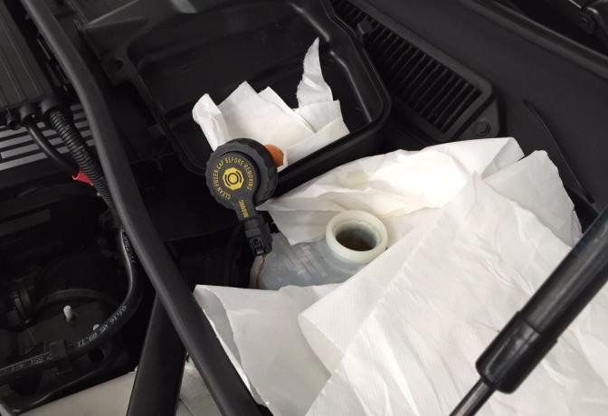

---
:point_left: [Retour au sommaire](../README.md#sommaire)
