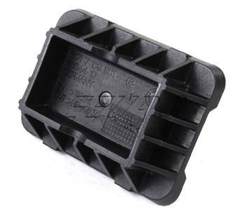
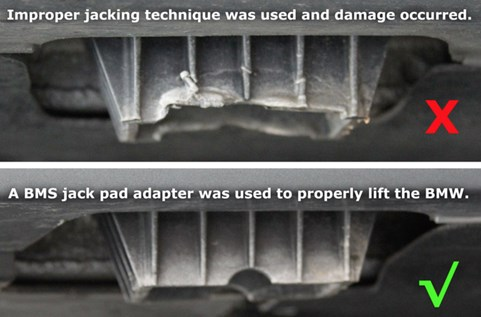
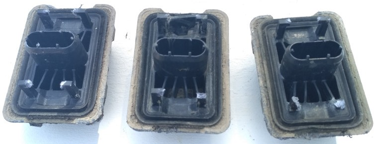
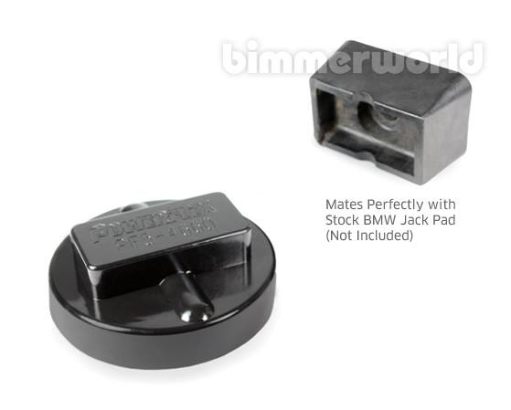
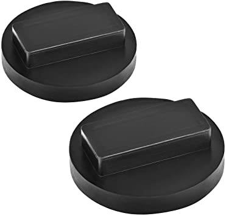

# [FAQ] Remplacement des supports de cric

## Pourquoi ?

Remplacer ces pièces (x4) représentant les points de levage de la voiture :

Souvent abîmés par une mauvaise utilisation :

La technique est d’utiliser un gros tournevis pour faire levier (et éventuellement un 2ème en renfort).

**/!\\** Il y a 95% de risque que la pièce une fois enlevée soit totalement HS (les fixations ne résistent généralement pas au démontage).

**(i)** Si le démontage est un peu chiant le remontage de la nouvelle pièce est par contre hyper simple : "clic".

## Référence / Tarifs

- **Référence BMW :** `51 71 7 123 311`
- **Nom :** Support de fixation de pont élévateur
- **Valable pour :** E87, E81, E88, E82, E84, F48, F49, E90, E91, F34, F07, F10, F11, F18, F06, F13, F01, F02, F03, F04, F39
- **Prix :** environ 15€ pièce HT
- **Non-OEM :** exemple FEBI-BILSTEIN : <https://www.oscaro.com/fixation-cric-febi-bilstein-45763-6861759-990-p> (-15€ HT pièce)
- **Non-OEM :** exemple les 4 : <https://www.auto-doc.fr/blic/13249950>

## Ressources vidéos

- Fab B. (FR) : <https://www.youtube.com/watch?v=vWZuS6J8G5A>
- Georges Auster (EN) : <https://www.youtube.com/watch?v=Mcc8O2LfeDI>

## Conseils

Toujours utiliser des Jack Pads adaptés aux supports :

Autre exemple, moins qualitatif que les Powerflex :

---
:point_left: [Retour au sommaire](../README.md#sommaire)
