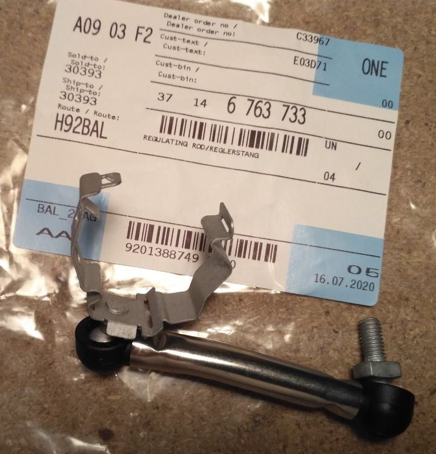
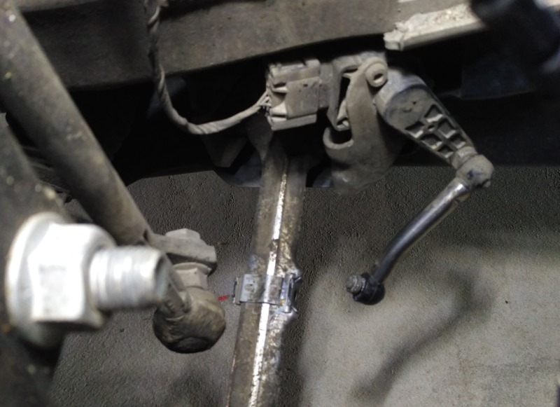
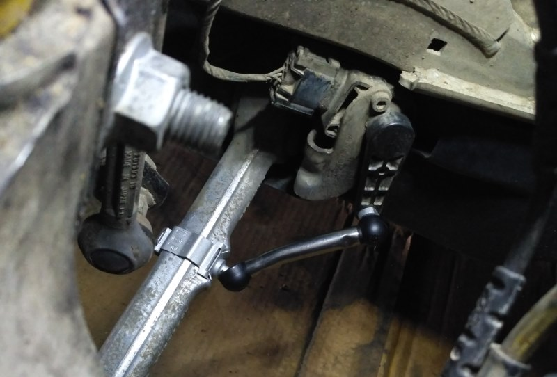
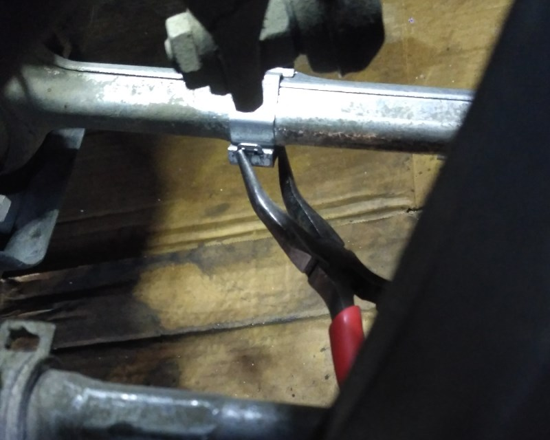

# [TUTO] Remplacement de la tige du capteur d’assiette des Xénons (avant)

Je vous propose ce petit tuto plutôt dans un but informatif qu’explicatif. La manipulation étant assez simple.

Au démarrage la voiture doit ajuster la hauteur des phares Xénons (contrairement aux halogènes). Ceci se fait par l’intermédiaire d’un capteur présent sur le bras de la roue avant gauche.

Il peut arriver avec l’age que la pièce (une partie) se casse et ne remplisse plus sa fonction. On ne s’en rend pas forcément compte si on ne démonte pas régulièrement ses roues. Un symptôme possible est que les phares éclairent trop bas.

**(i)** Cette fiche ne concerne que le capteur sur la **roue avant gauche**, il existe un capteur équivalent au niveau de la roue arrière gauche.

## La pièce en question

Référence :  `37 14 6 763 733` [bmwfans](http://fr.bmwfans.info/parts-catalog/E87/Europe/130i-N52/L-N/jan2006/browse/front_axle/headlight_vertical_aim_control_sensor)

Tarif indicatif : environ 17€ sur [ebay (pièce 100% BMW)](https://www.ebay.fr/itm/NEW-GENUINE-BMW-1-3-X1-SERIES-E87-E90-E84-AND-MORE-FRONT-ADJUST-ROD-37146763733/272583368032?ssPageName=STRK%3AMEBIDX%3AIT&_trksid=p2060353.m2749.l2649)

## Outils nécessaires

- Une clef plate de 11mm
- Une clef plate, à œil ou à pipe de 10mm
- Un petit tournevis plat
- Une petite pince

## Procédure

Démonter la roue avant gauche

Constater le défaut (visible sans démonter la roue si besoin) :

Faire sauter la partie clipsée sur le bras avec un tournevis plat et/ou la pince.

Dévisser le petit bras avec la clef plate de 11 et la clef de 10 pour maintenir l’écrou de 10mm caché derrière.

Installer la nouvelle pièce (respecter bien l’inscription TOP) :

Remettre le clips est un peu chiant, utiliser une petite pince :

## Conclusion

Voilà rien de folichon, c’est juste bon à savoir si jamais çà vous arrive.

Et surtout qu’on peut le faire soit même pour pas cher.

---
:point_left: [Retour au sommaire](../README.md#sommaire)
