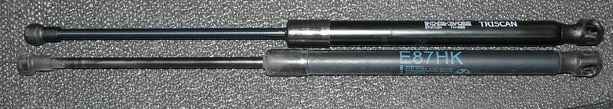
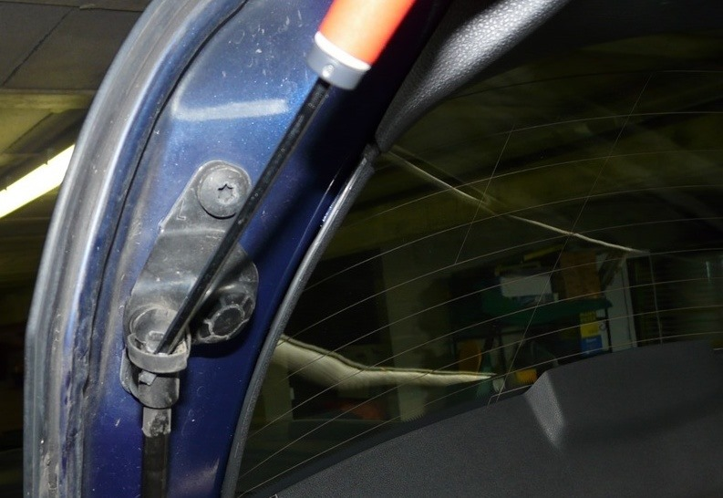
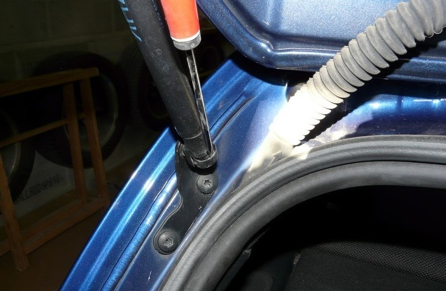
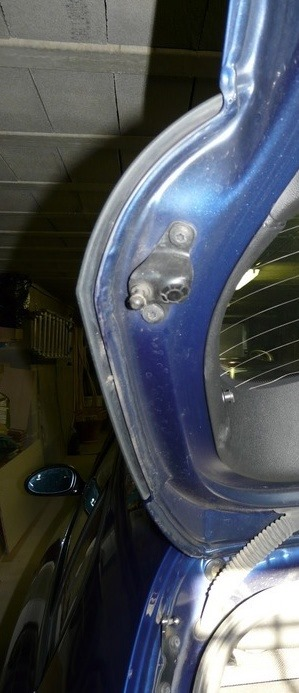
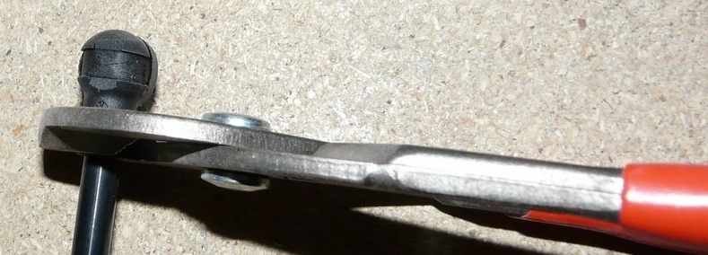
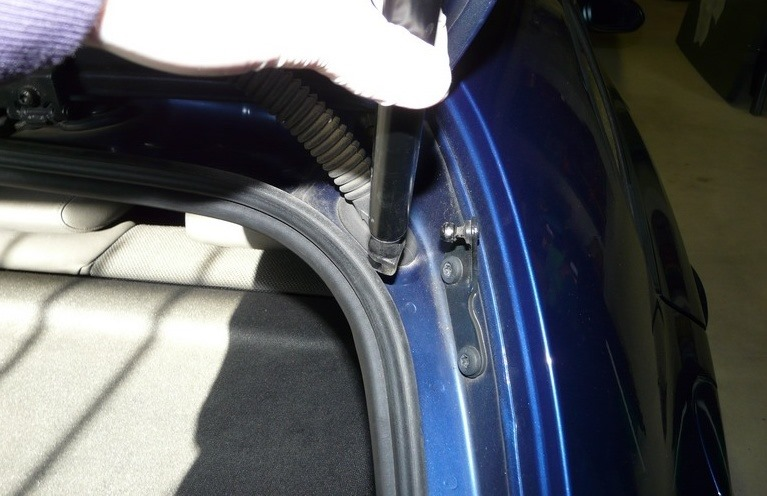

# [TUTO] Remplacer les vérins de coffre ou de capot

## Références

- Vérin de coffre : Référence BMW : `51 24 7 060 622`
  - [RealOEM](https://www.realoem.com/bmw/fr/showparts?id=UF91-EUR---E87-BMW-130i&diagId=41_1615)
  - [Oscaro](https://www.oscaro.com/verin-stabilus-0685vr-2045042-3277-p#/?vid=1565)
- Vérin de capot : Référence BMW : `51 23 7 118 370` puis `51 23 7 225 518`
  - [RealOEM](https://www.realoem.com/bmw/fr/showparts?id=UF91-EUR---E87-BMW-130i&diagId=41_1611)
  - [Oscaro](https://www.oscaro.com/verin-stabilus-0681vk-2045041-3277-p#/?vid=1565)

Attention les vérins sont vendus à l'unité. Pensez donc à en commander 2.

## Tarifs

- environ 40€ pour des **Triscan**
- environ 70€ pour des **Stabilus** (origine)
- environ 86€ chez BMW

## Démontage du vérin

On commence par le haut du vérin (plus facile). Il suffit simplement d'insérer un petit tourne-vis plat sous le clips métallique et le faire "sauter".

On passe à celui-du bas, même technique :

On tire (assez fort) sur le vérin pour le déclipser. Voila le résultat :

**Attention :**

- ces clips ont une fâcheuse tendance à "voler" partout.
- une fois le 1er vérin enlevé il est possible que le 2ème (si également HS) ne puisse pas soutenir le poids du hayon ou du capot, attention donc à ne pas prendre le hayon ou le capot sur la tête.

## Remontage du vérin

En profiter pour faire un peu de nettoyage avant le remontage.

Orienter les "orifices" pour qu'ils puissent tomber en face des "boules", j'ai utilisé une pince mais on peut sûrement le faire à la main :

J'ai commencé par enclencher le haut (pousser en force ça doit se clipser) puis avec la deuxième main j'ai joué sur la hauteur du hayon pour enclencher celui du bas :

### Remarque

Les vérins sont je pense, à l'image des Triscan, déjà tous livrés graissés.

### Vidéos

- Avant : http://www.youtube.com/watch?v=TH7q0a9oXCA
- Après : http://www.youtube.com/watch?v=7YEAHFaALL8
