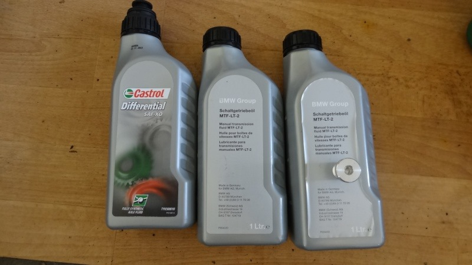
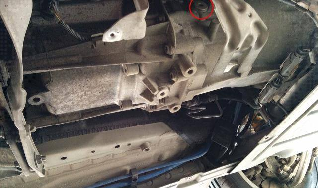
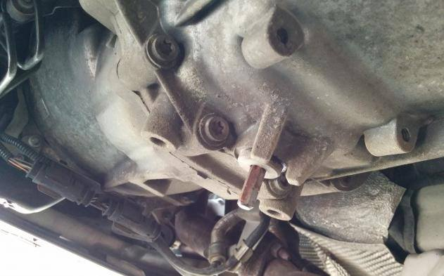

# [TUTO] Vidange de la boite de vitesses manuelle

## Liste du matériel nécessaire

- Huile 2x1L Ref : `83 22 2 339 219` (MTF LT-2) ~ 20€ HT
- 2 bouchons Ref : `23 11 7 531 35 6` ~ 6.59€ HT
- Un bac de vidange de 1,5L minimum
- Clef avec embout hexagonal type BTR de 8mm (H8), pour les bouchons de remplissage et vidange
- Une douille de 8mm et son cliquet, pour le carter de protection plastique
- Une seringue pour le remplissage de l’huile par le côté
- Et dans l'idéal, une clé dynamométrique pour resserrer les bouchons au couple

## ÉTAPE 1 : Faire monter l’huile en température

Si le moteur est froid aller faire un petit tour pour faire monter en température l’huile. Une huile plus chaude sera plus fluide et donc s’écoulera plus facilement.

## ÉTAPE 2 : Dépose du carter de protection

Lever la voiture

Déposer le carter plastique : Prenez votre clé de 8/cliquet avec douille et enlevez les 6 vis :

Pivoter le plastique pour pouvoir le sortir complètement.

## ÉTAPE 3 : Déposer le bouchon de remplissage

Dévisser le bouchon de remplissage (Embout hexagonal de 8mm) :

**Attention :**

1. il n’y a pas beaucoup d’espace : 7cm. Il faut donc que votre embout+porte embout+cliquet ne dépasse pas cette taille sinon il sera impossible de dévisser ce bouchon.
2. bien enfoncer à fond votre embout dans le bouchon avant de desserrer sous peine de l’abîmer.
3. la ligne d’échappement passe tout prêt, attention aux risques de brûlures.

**Si vous ne pouvez pas dévisser ce bouchon pas la peine de continuer sous peine de ne pas pouvoir remplir !**

## ÉTAPE 4 : Vidange

Enfiler ses gants, préparer le bac de vidange (1.5L minimum, par exemple un bidon d’eau déminéralisée).

Déposer le bouchon de vidange :

**_Attention : à bien enfoncer à fond votre embout dans le bouchon avant de desserrer sous peine de l’abîmer._**

Laisser couler l’huile, l’idéal est de repositionner la voiture à l’horizontal si ce n’était pas le cas, afin de vidanger un maximum d’huile.

## ÉTAPE 5 : Remettre le nouveau bouchon de vidange

Quand l'huile a fini de couler, nettoyer puis reposer le bouchon de vidange neuf (qui comporte son joint torique) au couple de 35Nm si possible :

## ÉTAPE 6 : Remplissage

**_ASTUCE :_** Il faut bien secouer le bidon d'huile de boîte avant de l'ouvrir afin de bien mélanger les additifs.

Capacité max 1,6L après démontage/remontage complet, 1,5L après vidange. Le remplissage se fait par débordement.

Remplir via le trou de remplissage avec la seringue :

Répéter l’opération plusieurs fois suivant la contenance de votre seringue, jusqu’au débordement.

Une fois le plein fait (y aller doucement à l’approche des 1.5L), refermer avec le 2ème bouchon de remplissage neuf mais seulement à la main.

**_ASTUCE :_** Démarrer le moteur pour faire circuler l’huile, laisser tourner un petit moment, passer les vitesses dans le « vide » puis éteindre le moteur et refaire l’appoint si besoin.

## ÉTAPE 7 : Finalisation

Revisser complètement le bouchon (couple 35Nm comme pour l’autre bouchon).

**-** Rajouter un coup d’aérosol de nettoyage de freins pour nettoyer tout ça :

Remonter le carter de protection et reposer la voiture. Fin de l’opération.
