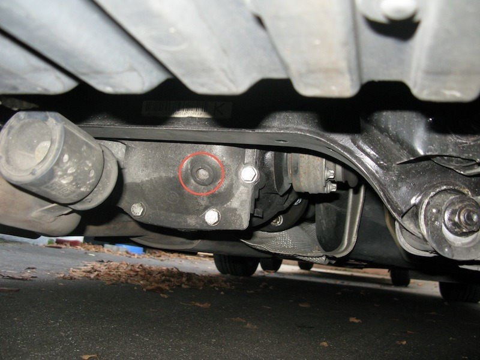
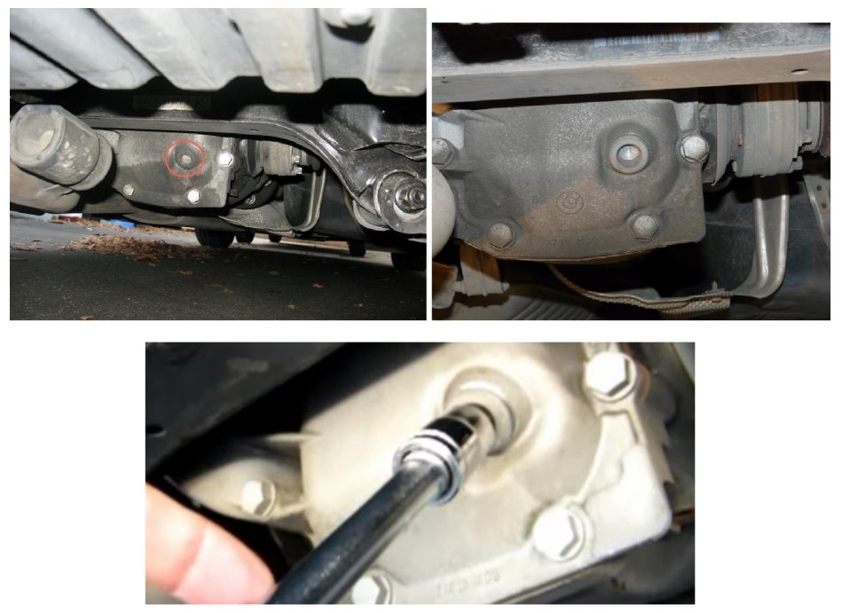
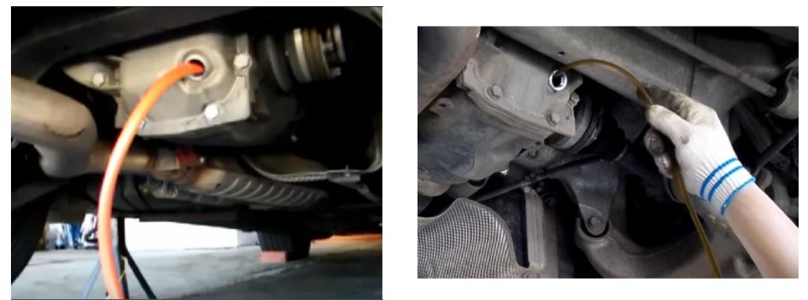
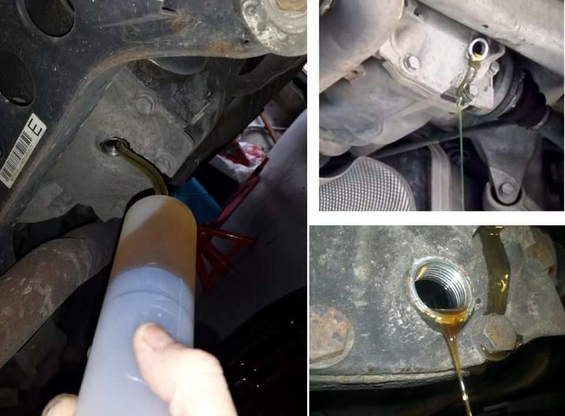
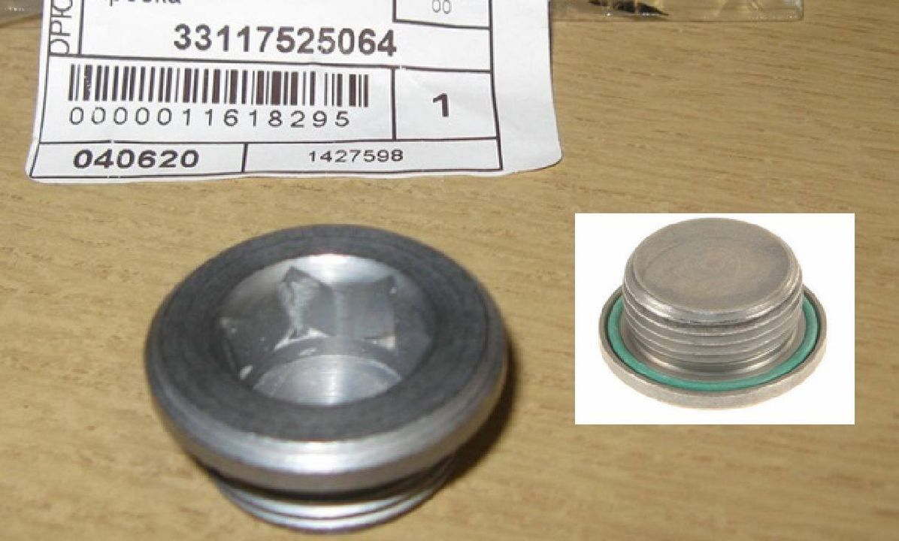
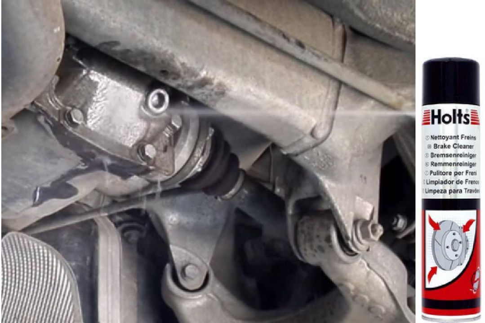

# [TUTO] Vidange du différentiel arrière (pont)

## Liste du matériel nécessaire

- Huile 1L `83 22 2 365 987` (BMW Synthetik OSP) ~ 30€ HT
- Bouchon `33 11 7 525 064` ~ 4.14€ HT
- Un bac de vidange de 1L minimum
- Niveau à bulle pour vérifier que la voiture est bien droite
- Clef avec embout hexagonal type BTR de 14mm (H14), pour le bouchon
- Une seringue pour le vidage et le remplissage de l’huile
- Une clé dynamométrique pour resserrer le bouchon au couple

## ÉTAPE 1 : Faire monter l’huile en température

Si le moteur est froid aller faire un petit tour pour faire monter en température l’huile. Une huile plus chaude sera plus fluide et donc s’écoulera plus facilement.

## ÉTAPE 2 : Lever la voiture

Lever la voiture de manière à ce qu’elle soit bien droite (vérifier au niveau) et à ce que l’on puisse accéder sous la voiture au différentiel arrière (le pont).

## ÉTAPE 3 : Déposer le bouchon

Dévisser l’unique bouchon alu de remplissage (Embout hexagonal de 14mm) :

**Attention : bien enfoncer à fond votre embout dans le bouchon avant de desserrer sous peine de l’abîmer et de ne pas pouvoir le desserrer.**

## ÉTAPE 4 : Vidange

Enfiler ses gants, préparer le bac de vidange (1L minimum, par exemple un bidon d’eau déminéralisée) et la seringue pour l’aspiration de l’ancienne huile.

Effectuer la vidange par aspiration avec votre seringue. Cette opération est plus ou moins longue en fonction de la contenance de votre seringue.

## ÉTAPE 5 : Remplissage

**_ASTUCE :_** Il faut bien secouer le bidon d'huile avant de l'ouvrir afin de bien mélanger les additifs.

Capacité max 1L environ. Le remplissage se fait par débordement.

Remplir via le trou de remplissage avec la seringue, vous remplissez d'huile jusqu’à ce que le niveau d'huile arrive à "fleur" en bas du bouchon de niveau :

- Préparer votre bidon (bac à vidange) pour réceptionner l’excédent.
- Répéter l’opération plusieurs fois suivant la contenance de votre seringue, jusqu’au débordement.
- Quand l'huile commencera à couler du bouchon de niveau, laissez là couler car le niveau d'huile doit être juste à ras du bas du bouchon.

Le bouchon de remplissage est placé très exactement de manière à y introduire le bon volume. C‘est pour cette raison que le véhicule doit être, plus ou moins, à niveau. Pas assez d'huile on "casse" le pont, trop d'huile on peut endommager les joints spi de cardan.

Source : <http://www.darkgyver.fr>

## ÉTAPE 6 : Remettre un nouveau bouchon

Il est fortement conseillé de remplacer le bouchon de vidange par un bouchon neuf car les bouchons et les vis en aluminium sont généralement à usage unique (référence `33 11 7 525 064`).

Quand l'huile a fini de couler, nettoyer l’orifice puis reposer le bouchon de vidange neuf (qui comporte son joint torique) au couple de **60Nm** si possible (Référence BMW du couple à appliquer `33 11 2AZ`).

**_Attention : commencer par serrer le bouchon à la main puis bien enfoncer à fond votre embout dans le bouchon avant de commencer le serrage avec la clef._**

## ÉTAPE 7 : Nettoyage

Nettoyez les salissures d’huile.

**_ASTUCE :_** Utiliser un aérosol de nettoyant pour freins pour nettoyer tout ça :

Fin de l’opération.

---
:point_left: [Retour au sommaire](../README.md#sommaire)
